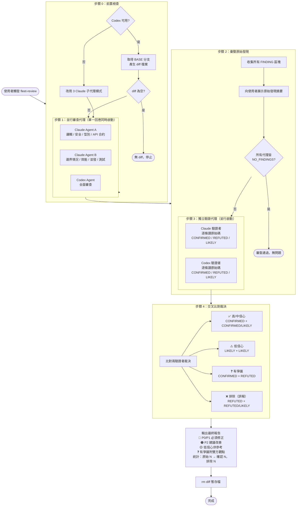

# Fleet Review 工作流程圖

## Sub-agent 數量總覽

| 步驟 | Sub-agent 數 | 說明 |
|------|-------------|------|
| 步驟 0 前置檢查 | **0** | 只跑 Bash 指令 |
| 步驟 1 審查代理 | **3** | Claude-A + Claude-B + Codex（並行） |
| 步驟 2 彙整發現 | **0** | 主代理自行整理 |
| 步驟 3 獨立驗證 | **2** | Claude 驗證者 + Codex 驗證者（並行） |
| 步驟 4 最終報告 | **0** | 主代理自行比對輸出 |
| **總計** | **5** | |

---

## 代理數量總覽

| 階段 | 正常模式 | Codex 不可用 |
|------|----------|--------------|
| 審查代理 | Claude-A + Claude-B + Codex | Claude-A + Claude-B + Claude-C |
| 驗證代理 | Claude 驗證者 + Codex 驗證者 | Claude（延伸思考）+ Claude（一般） |
| **合計** | **5 個代理** | **5 個代理** |

## 裁決交叉比對規則

| Claude 驗證者 | Codex 驗證者 | 結果 |
|---|---|---|
| CONFIRMED | CONFIRMED | ✅ 高信心，納入 |
| CONFIRMED | LIKELY | ✅ 中信心，納入 |
| LIKELY | CONFIRMED | ✅ 中信心，納入 |
| LIKELY | LIKELY | ⚠️ 低信心，標注後納入 |
| CONFIRMED | REFUTED | ❓ 有爭議，附雙方觀點 |
| REFUTED | CONFIRMED | ❓ 有爭議，附雙方觀點 |
| LIKELY | REFUTED | ❌ 排除 |
| REFUTED | LIKELY | ❌ 排除 |
| REFUTED | REFUTED | ❌ 排除（誤報） |
