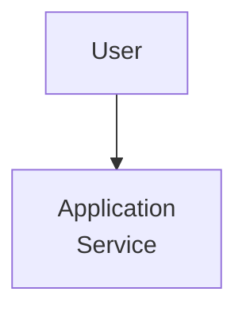
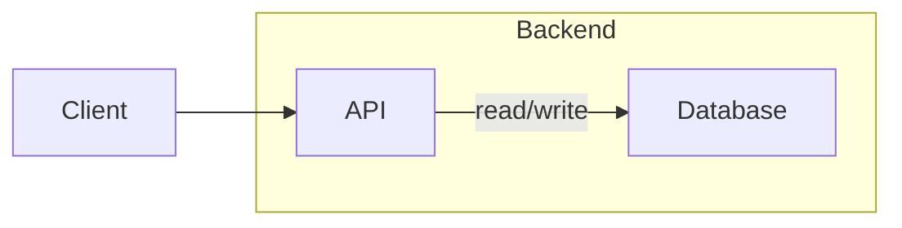

# Mermaid Coding Standard

Use this skill whenever you need to generate or modify Mermaid code. The goal is to produce Mermaid diagrams that are easy to read, stable in diffs, and compatible across common Markdown renderers.

## Triggering

This skill has two entry points:

1. The user explicitly calls `mermaid-coding-standard`.
2. The model automatically determines that the current task requires generating, modifying, or returning Mermaid code.

Load this skill whenever the response will contain a Mermaid fenced code block, or whenever the task requires Mermaid syntax that can be pasted into Markdown. This includes requirements documents, architecture explanations, flowcharts, sequence diagrams, class diagrams, state diagrams, ER diagrams, and any scenario that uses Mermaid to express logical relationships.

## Output Formatting

1. Put every Mermaid diagram inside a fenced code block with the `mermaid` language tag.
2. Keep one Mermaid statement per line.
3. Use blank lines to separate logical groups in large diagrams.
4. Do not use `\n` inside Mermaid labels; use `<br>` when a label needs a visible line break.
5. Prefer concise labels. If a label becomes long, split it with `<br>` instead of making the diagram line unreadable.

### Example

````markdown

````

## Node Naming

1. Node ID must use only alphanumeric characters and underscores (`A-Z`, `a-z`, `0-9`, `_`).
2. Node ID should be concise and stable.
3. Node ID and displayed label must be separated.
4. Do not use spaces, punctuation, paths, URLs, or localized text as Node IDs.

### Example

```mermaid
UserProfile["User Profile"]
```

* `UserProfile` = Node ID
* `User Profile` = Node Label

---

## Node Label

1. All Node Labels must be enclosed in double quotes (`"`).
2. Do not omit quotes even if the label contains only alphanumeric characters.
3. This rule applies to English, Chinese, paths, URLs, and all other text.
4. Escape literal double quotes inside labels when needed.

### Example

```mermaid
A["User"]
B["User Profile"]
C["/content/site/page"]
D["cq:dialog"]
E["User Settings"]
```

---

## Edge Label

1. All Edge Labels must be enclosed in double quotes (`"`).
2. Never use unquoted edge labels.
3. Keep edge labels short and action-oriented.
4. When the relationship is obvious, omit the edge label instead of adding noise.

### Example

```mermaid
A -- "sling:resourceType" --> B
A -- "Load User Data" --> B
```

---

## Diagram Layout

1. Declare the diagram type first, then put all nodes and edges below it.
2. Use indentation consistently inside subgraphs.
3. Name subgraphs with quoted labels.
4. Keep related nodes close together in the source order.
5. Prefer stable ordering over visually clever ordering; stable source makes future edits easier.

### Example



---

## Review Checklist

Before returning Mermaid code, verify:

1. Every Node Label is quoted.
2. Every Edge Label is quoted.
3. Every Node ID uses only letters, numbers, or underscores.
4. No label uses `\n`; use `<br>` instead.
5. The diagram is inside a `mermaid` fenced code block when returned in Markdown.
6. The source order is readable and grouped by purpose.

---

## Rationale

Using double quotes consistently:

1. Prevents Mermaid parse errors.
2. Improves compatibility across GitHub, GitLab, Azure DevOps, Confluence, VS Code, and Mermaid Live Editor.
3. Reduces maintenance overhead.
4. Eliminates the need to remember special-character rules.
5. Produces more stable diffs when labels change.

