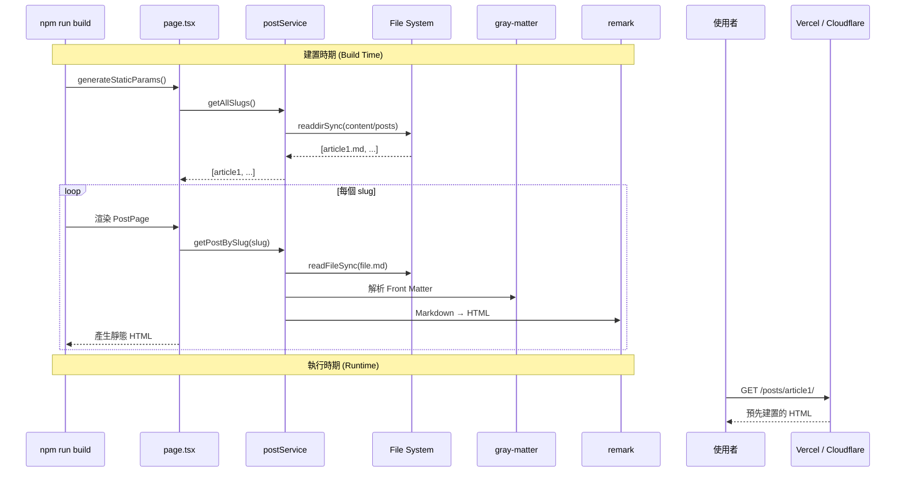
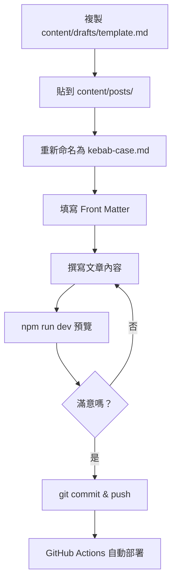

> 依據規格文檔步驟進行開發，請按照 Step 順序實作，有相依關係的步驟須完成前置步驟後再進行。

# 文章讀取與顯示流程解析

## Step 1：目錄結構

```
content/
├── posts/            # 正式文章（會被讀取顯示）
└── drafts/           # 草稿與模板（不會被讀取）
    └── template.md
```

| 目錄 | 用途 | 是否被系統讀取 |
|------|------|----------------|
| `content/posts/` | 正式發布的文章 | ✅ 是 |
| `content/drafts/` | 草稿、模板、未完成文章 | ❌ 否 |

## Step 2：Front Matter 格式

```yaml
---
title: 文章標題
excerpt: "簡短摘要描述（建議 50-100 字）"
date: 2025-01-31 10:00:00+08:00
tags: [tag1, tag2]
categories: 分類名稱
---
```

| 欄位 | 必填 | 說明 |
|------|------|------|
| `title` | Y | 文章標題，顯示於頁面和列表 |
| `excerpt` | Y | 摘要，顯示於文章卡片 |
| `date` | Y | 發布日期，格式 `YYYY-MM-DD HH:mm:ss+08:00`（必須加時區） |
| `tags` | N | 標籤，可為字串或陣列 |
| `categories` | N | 分類名稱 |

> **注意**：日期必須加上時區 `+08:00`，否則 gray-matter 會將日期當作 UTC 解析，導致顯示日期偏移。

## Step 3：URL 路徑規則

URL 路徑根據**檔名**產生，不是 Front Matter 中的 title：

```
檔名：my-first-post.md → fileNameToSlug() → slug：my-first-post → URL：/posts/my-first-post/
```

| 規則 | 範例 | 結果 |
|------|------|------|
| 使用英文 + 連字號 | `docker-basics.md` | ✅ `/posts/docker-basics/` |
| 避免空格 | `my post.md` | ❌ 可能產生問題 |
| 自動轉小寫 | `Docker-Basics.md` | `/posts/docker-basics/` |

## Step 4：系統架構

```
content/posts/*.md
        │
        ▼
postService.ts
  • fs.readFileSync()            讀取檔案
  • gray-matter                  解析 Front Matter
  • normalizeTags()              正規化標籤
  • remark + remark-gfm         解析 Markdown（支援 GFM 語法）
  • remark-rehype + rehype-slug  轉換為 HTML 並加標題錨點
        │
   ┌────┴────┐
   ▼         ▼
app/page.tsx                    app/posts/[slug]/page.tsx
getAllPosts()                    getPostBySlug()
PostListItem[]（只有元資料）    Post + renderMarkdown()（完整內容 + HTML）
```

## Step 5：建置流程



## Step 6：新增文章流程



## Step 7：常見陷阱

| 陷阱 | 說明 | 解決方式 |
|------|------|----------|
| tags 型別不一致 | tags 可能是字串或陣列 | `normalizeTags()` 統一轉為陣列 |
| 日期時區問題 | 未加時區導致日期偏移 | 日期格式加上 `+08:00` |
| Hydration Mismatch | Server/Client 渲染不一致 | 使用 `<Suspense>` 包裹 |
| slug 大小寫問題 | URL 不區分大小寫 | `fileNameToSlug()` 統一轉小寫 |
| 目錄不存在 | 新專案無 content/posts | `fs.existsSync()` 檢查 |
| 無效日期格式 | 模板佔位符產生 NaN | 模板放 `drafts/` 不被讀取 |

## Step 8：快速檢查清單

- [ ] 檔名使用 kebab-case（小寫英文 + 連字號）
- [ ] Front Matter 日期格式正確，含時區 `+08:00`
- [ ] tags 使用陣列格式 `[tag1, tag2]`
- [ ] 文章放在 `content/posts/` 目錄
- [ ] 本機 `npm run dev` 預覽確認無誤
