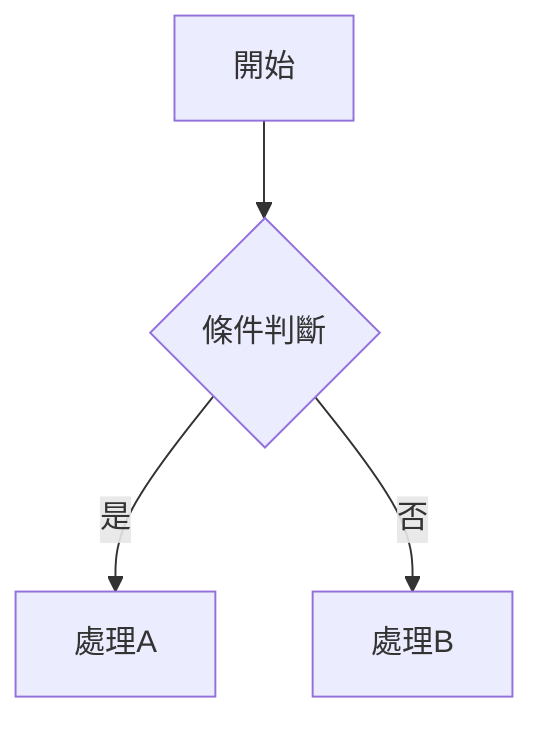
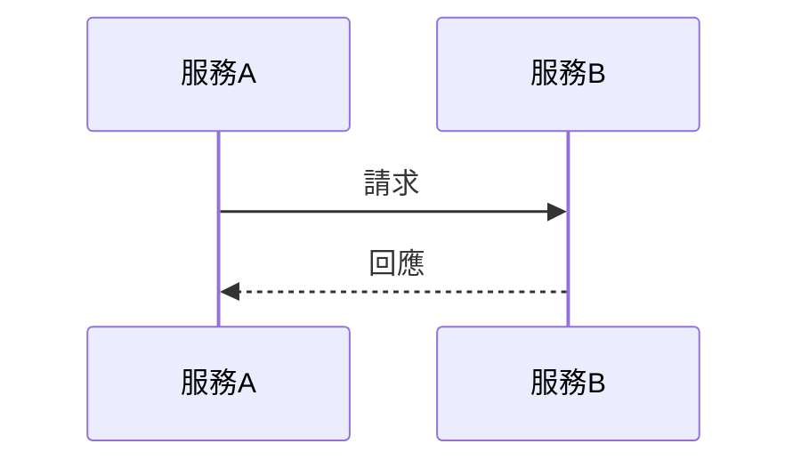

# 文件撰寫指南

## 核心原則

1. **專注概念層次**：可包含必須的程式實作細節，專注於概念、流程和架構
2. **視覺化優先**：多使用流程圖、表格、架構圖來說明概念，可使用 ASCLL ART
3. **標準格式**：使用標準 Markdown 語法，時序圖與流程圖使用 Mermaid Code  
4. **一致風格**：保持整篇文章風格一致，包括用詞、格式和排版
5. **類比說明**：適當使用類比來幫助讀者理解複雜概念
6. **不需要前言**：不需要撰寫前言、結語等非必要段落
7. **不需要多餘的建議**：不需要記憶口訣、延伸學習建議等多餘資訊
8. **延伸閱讀**：可包含延伸閱讀連結，但不需要額外說明
9. **繁體中文**：所有內容使用繁體中文撰寫

## Front Matter 格式

所有 Blog 文章必須包含 YAML Front Matter：

```yaml
---
title: 文章標題
excerpt: "文章摘要，簡述文章重點"
date: 2025-01-31 10:00:00
tags: [標籤1, 標籤2]
categories: 分類名稱
---
```

| 欄位 | 必填 | 說明 |
|------|------|------|
| `title` | ✅ | 文章標題 |
| `excerpt` | ✅ | 文章摘要，用於卡片預覽 |
| `date` | ✅ | 發布日期，格式 `YYYY-MM-DD HH:MM:SS` |
| `tags` | ✅ | 標籤陣列，用於分類篩選 |
| `categories` | ⚠️ | 主分類（可選） |

## 文件結構範本

根據文件類型選擇適當的結構：

### Blog 文章（一般）
```
# 標題
## 前言（為何寫這篇）
## 核心概念
## 實作說明（含程式碼或圖表）
## 常見問題 / 注意事項
## 總結
```

### 技術教學文章
```
# 標題
## 前言（解決什麼問題）
## 環境準備 / 前置條件
## 步驟說明（Step by Step）
## 完整範例
## 延伸閱讀
```

### 技術設計文件
```
# 標題
## 問題背景（為何需要）
## 解決方案概述
## 架構設計（含圖表）
## 優缺點分析（使用表格）
## 適用場景
## 結論
```

### 流程說明文件
```
# 標題
## 流程概述
## 流程圖（Mermaid）
## 各步驟說明
## 注意事項
```

## 視覺化元素使用指南

### 表格：用於比較與分析
- 欄位清晰、對齊一致
- 使用 emoji 標記狀態（✅ ❌ ⚠️）

### 流程圖：用於說明處理流程


### 時序圖：用於說明元件互動


### ASCII 架構圖：用於說明系統結構
```
┌─────────────────┐
│  元件名稱        │
│  ├── 子項目 A   │
│  └── 子項目 B   │
└─────────────────┘
```

## 範例參考

參考 `examples/example.md` 作為文件撰寫範本

## 輸出位置

- 如果用戶指定了輸出路徑 `$1`，將文件寫入該路徑
- 如果未指定路徑，詢問用戶要存放的位置與檔名
