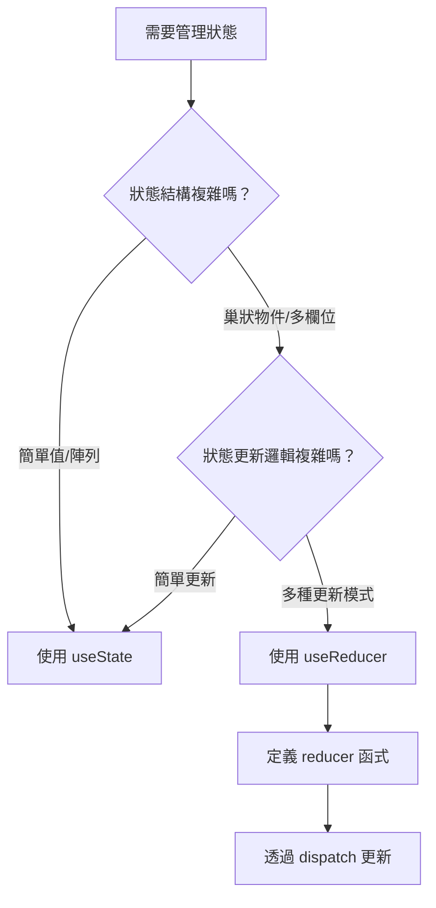

# React 狀態管理：從 useState 到 useReducer

## 前言

在開發 React 應用時，狀態管理是最常遇到的課題之一。React 提供了 `useState` 和 `useReducer` 兩種 Hooks 來處理元件狀態，但許多開發者不確定何時該用哪一個。

本文將透過實際案例，幫助你理解兩者的差異與適用場景。

## 核心概念

### useState vs useReducer 比較

| 特性 | useState | useReducer |
|------|----------|------------|
| 適用複雜度 | 簡單狀態 | 複雜狀態邏輯 |
| 狀態更新方式 | 直接設值 | 透過 action 派發 |
| 程式碼可測試性 | 一般 | ✅ 容易測試 |
| 狀態邏輯集中度 | 分散 | ✅ 集中管理 |
| 學習曲線 | ✅ 低 | 中等 |

### 決策流程



## 實作說明

### 使用 useState 的情境

適合簡單的狀態管理，例如開關、計數器、單一輸入值：

```typescript
// 簡單計數器 - 使用 useState 足矣
const [count, setCount] = useState(0);

// 直接更新狀態
const increment = () => setCount(prev => prev + 1);
```

### 使用 useReducer 的情境

當狀態邏輯變得複雜時，useReducer 能讓程式碼更清晰：

```typescript
// 定義 action 類型，明確描述所有可能的狀態變更
type Action =
  | { type: 'INCREMENT' }
  | { type: 'DECREMENT' }
  | { type: 'RESET' }
  | { type: 'SET_VALUE'; payload: number };

// reducer 函式集中處理所有狀態邏輯
function counterReducer(state: number, action: Action): number {
  switch (action.type) {
    case 'INCREMENT':
      return state + 1;
    case 'DECREMENT':
      return state - 1;
    case 'RESET':
      return 0;
    case 'SET_VALUE':
      return action.payload;
    default:
      return state;
  }
}

// 元件中使用
const [count, dispatch] = useReducer(counterReducer, 0);

// 透過 dispatch 派發 action
dispatch({ type: 'INCREMENT' });
```

## 常見問題

### Q: 什麼時候該從 useState 換成 useReducer？

當你發現以下情況時，可以考慮重構：

1. **多個 useState 互相關聯** - 更新一個狀態時需要同時更新另一個
2. **狀態更新邏輯散落各處** - 相同的更新邏輯在多處重複
3. **難以追蹤狀態變化** - 不確定狀態是在哪裡被改變的

### Q: useReducer 會影響效能嗎？

不會。useReducer 和 useState 在效能上沒有顯著差異，選擇應基於程式碼的可維護性。

## 總結

| 選擇 | 適用情境 |
|------|----------|
| **useState** | 簡單狀態、獨立狀態、快速原型 |
| **useReducer** | 複雜狀態邏輯、多種更新模式、需要可測試性 |

記住：沒有絕對的對錯，選擇讓你的程式碼更清晰、更容易維護的方式即可。
