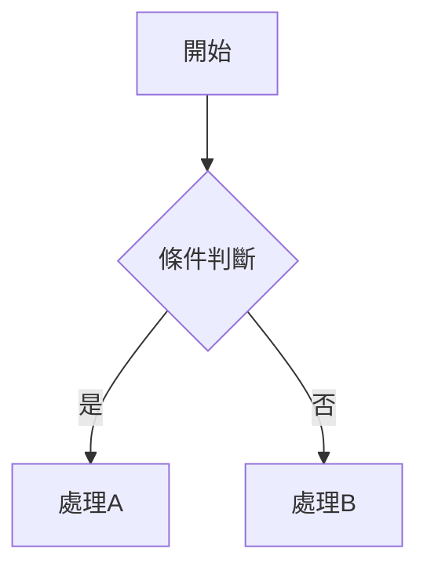
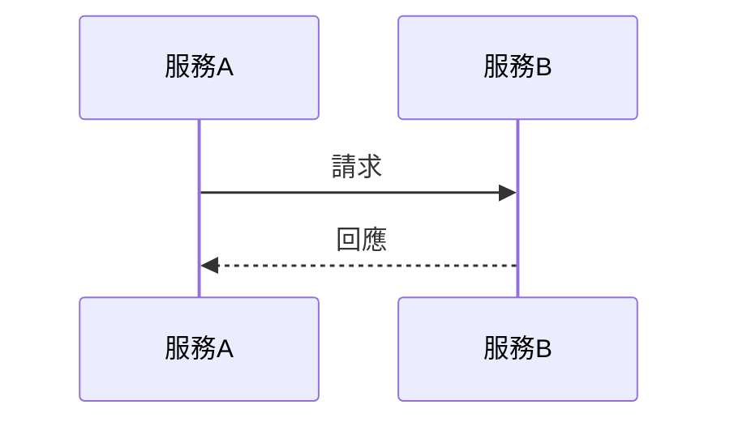

# 文件撰寫指南

## 核心原則

1. **專注概念層次**：不包含詳細的程式實作細節，專注於概念、流程和架構
2. **視覺化優先**：多使用流程圖、表格、架構圖來說明概念，可使用 ASCLL ART
3. **標準格式**：使用標準 Markdown 語法，時序圖與流程圖使用 Mermaid Code  
4. **繁體中文**：所有內容使用繁體中文撰寫

## 文件結構範本

根據文件類型選擇適當的結構：

### 技術設計文件
```
# 標題
## 問題背景（為何需要）
## 解決方案概述
## 架構設計（含圖表）
## 優缺點分析（使用表格）
## 適用場景
## 結論
```

### 流程說明文件
```
# 標題
## 流程概述
## 流程圖（Mermaid）
## 各步驟說明
## 注意事項
```

## 視覺化元素使用指南

### 表格：用於比較與分析
- 欄位清晰、對齊一致
- 使用 emoji 標記狀態（✅ ❌ ⚠️）

### 流程圖：用於說明處理流程


### 時序圖：用於說明元件互動


### ASCII 架構圖：用於說明系統結構
```
┌─────────────────┐
│  元件名稱        │
│  ├── 子項目 A   │
│  └── 子項目 B   │
└─────────────────┘
```

## 範例參考

參考 `examples/technical-design-example.md` 作為文件撰寫範本

## 輸出位置

- 如果用戶指定了輸出路徑 `$1`，將文件寫入該路徑
- 如果未指定路徑，詢問用戶要存放的位置與檔名
