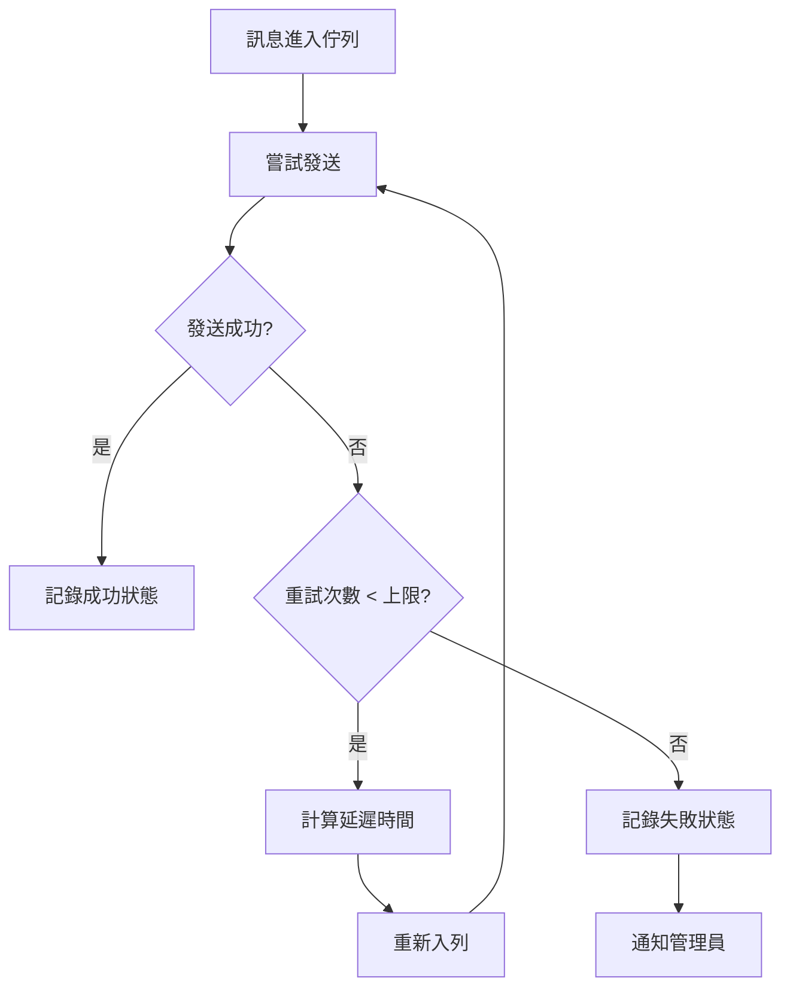
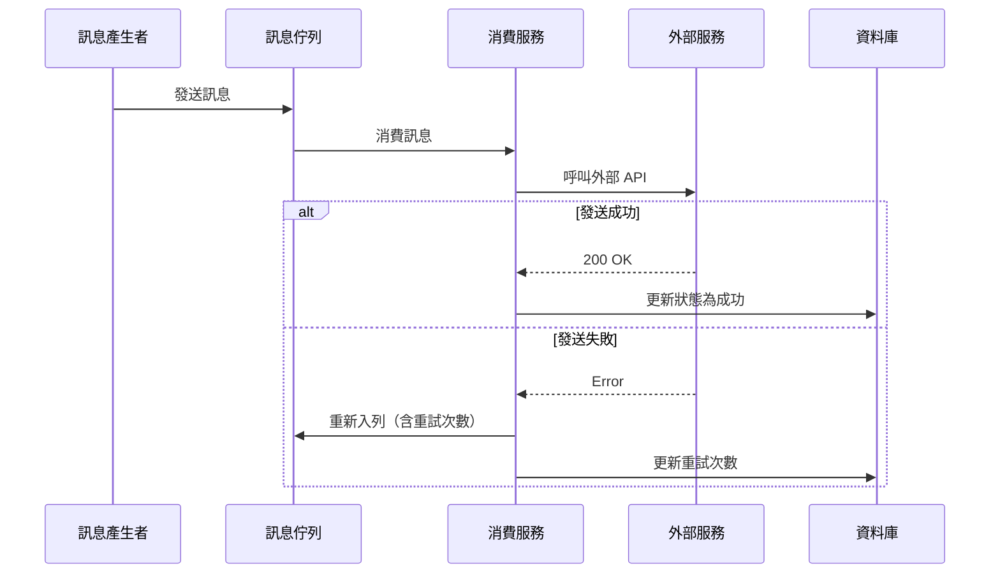

# 訊息重試機制設計說明

## 問題背景

當系統發送訊息（Email/SMS/推播）失敗時，需要有重試機制確保訊息最終能送達。

**核心需求：**
- 失敗訊息需自動重試
- 避免無限重試造成資源浪費
- 需記錄發送狀態供追蹤

## 解決方案概述

採用 **指數退避重試策略**，結合訊息佇列實現非同步重試：



## 架構設計

### 元件互動流程



### 系統架構

```
┌─────────────────────────────────────────────────────────┐
│  訊息重試系統                                            │
│                                                         │
│  ┌─────────────┐    ┌─────────────┐    ┌─────────────┐ │
│  │ 訊息產生者   │───▶│  訊息佇列   │───▶│  消費服務   │ │
│  └─────────────┘    └─────────────┘    └──────┬──────┘ │
│                            ▲                   │        │
│                            │ 重試              ▼        │
│                            └───────────  外部服務       │
└─────────────────────────────────────────────────────────┘
```

## 優缺點分析

| 面向 | 優點 | 缺點 |
|------|------|------|
| 可靠性 | ✅ 確保訊息最終送達 | ⚠️ 極端情況仍可能失敗 |
| 效能 | ✅ 非同步處理不阻塞主流程 | ⚠️ 增加佇列負載 |
| 維護性 | ✅ 重試邏輯集中管理 | ⚠️ 需監控佇列狀態 |
| 擴展性 | ✅ 可水平擴展消費者 | ❌ 需額外基礎設施 |

## 重試策略參數

| 參數 | 預設值 | 說明 |
|------|--------|------|
| 最大重試次數 | 3 | 超過後標記為永久失敗 |
| 基礎延遲 | 1 秒 | 首次重試的等待時間 |
| 退避係數 | 2 | 每次重試延遲倍數 |
| 最大延遲 | 60 秒 | 延遲時間上限 |

## 適用場景

### ✅ 適合使用
- 外部服務偶發性失敗（網路抖動、限流）
- 非即時性訊息發送
- 需要高送達率的通知系統

### ❌ 不適合使用
- 需要即時回應的同步操作
- 失敗後無需重試的場景
- 外部服務持續不可用

## 結論

指數退避重試機制適用於需要高可靠性的訊息發送場景，透過漸進式延遲避免對外部服務造成壓力，同時確保訊息最終送達。
