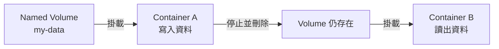
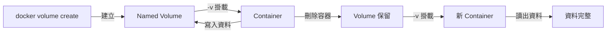

# Lab 01：Docker Volume 的使用方式

目標：建立 Docker Volume，掛載至容器，驗證資料在容器刪除後仍然保留，並理解 Bind Mount 與 Named Volume 的差異。

預估時間：40 分鐘。

---

## 你會做出什麼



`Named Volume` 是 Docker 管理的持久化儲存空間；`Container A` 將資料寫入 Volume；容器刪除後，Volume 內容不受影響；`Container B` 重新掛載同一個 Volume，即可讀回先前的資料。

---

## Step 1：確認環境

1. 開啟終端機，確認 Docker 已正常運行：

   ```
   docker version
   docker info
   ```

2. 列出目前存在的 Volume：

   ```
   docker volume ls
   ```

說明：若 `docker version` 回傳 `Cannot connect to the Docker daemon`，代表 Docker Desktop 尚未啟動，請先開啟它再繼續。

---

## Step 2：建立 Named Volume

1. 建立一個名為 `my-data` 的 Volume：

   ```
   docker volume create my-data
   ```

2. 確認 Volume 已建立：

   ```
   docker volume ls
   docker volume inspect my-data
   ```

   `inspect` 輸出範例：

   ```json
   [
     {
       "Name": "my-data",
       "Driver": "local",
       "Mountpoint": "/var/lib/docker/volumes/my-data/_data",
       ...
     }
   ]
   ```

| Parameter | Value |
| --- | --- |
| `Name` | `my-data` |
| `Driver` | `local` |
| `Mountpoint` | `/var/lib/docker/volumes/my-data/_data` |

說明：Named Volume 由 Docker 管理實體路徑，不需要自行指定主機目錄，這是它與 Bind Mount 最大的差異。

---

## Step 3：掛載 Volume 並寫入資料

1. 啟動一個 Alpine 容器，將 `my-data` 掛載到容器內的 `/data`，並寫入一個檔案：

   ```
   docker run --rm \
     -v my-data:/data \
     alpine \
     sh -c "echo 'hello from volume' > /data/hello.txt && cat /data/hello.txt"
   ```

2. 確認終端機輸出：

   ```
   hello from volume
   ```

說明：`-v my-data:/data` 的格式是 `<volume-name>:<container-path>`。容器結束後（`--rm` 自動刪除），Volume 內的資料仍然保留，這正是持久化儲存的核心用途。

---

## Step 4：驗證資料持久化

1. 用另一個全新容器掛載同一個 Volume，確認資料還在：

   ```
   docker run --rm \
     -v my-data:/data \
     alpine \
     cat /data/hello.txt
   ```

2. 預期輸出：

   ```
   hello from volume
   ```

說明：即使前一個容器已刪除，資料依然存在於 Volume 中，與容器的生命週期完全解耦。這是 Named Volume 的核心特性。

---

## Step 5：使用 Bind Mount 對比

Bind Mount 讓容器直接存取主機上的特定目錄，適合開發時同步原始碼。

1. 在主機建立一個測試目錄（Linux/macOS）：

   ```
   mkdir -p /tmp/bind-test
   echo "hello from bind mount" > /tmp/bind-test/hello.txt
   ```

   Windows（PowerShell）：

   ```
   New-Item -ItemType Directory -Force -Path C:\tmp\bind-test
   Set-Content C:\tmp\bind-test\hello.txt "hello from bind mount"
   ```

2. 啟動容器，掛載主機目錄：

   ```
   docker run --rm \
     -v /tmp/bind-test:/data \
     alpine \
     cat /data/hello.txt
   ```

   Windows 路徑寫法：

   ```
   docker run --rm -v C:\tmp\bind-test:/data alpine cat /data/hello.txt
   ```

3. 預期輸出：

   ```
   hello from bind mount
   ```

| 特性 | Named Volume | Bind Mount |
| --- | --- | --- |
| 路徑管理 | Docker 自動管理 | 由使用者指定主機路徑 |
| 可攜性 | 高（不依賴主機路徑） | 低（依賴主機目錄結構） |
| 適合場景 | 生產資料持久化 | 開發時同步原始碼 |
| 初始內容 | Docker 自動建立空目錄 | 使用主機現有內容 |

說明：Bind Mount 的格式是 `-v <host-path>:<container-path>`，當 `host-path` 是絕對路徑時，Docker 即判定為 Bind Mount 而非 Named Volume。

---

## Step 6：清理資源

1. 刪除 Volume（確認已不需要資料後執行）：

   ```
   docker volume rm my-data
   ```

2. 批次清理所有未使用的 Volume：

   ```
   docker volume prune
   ```

說明：`prune` 只會刪除沒有任何容器（包含停止中的容器）正在使用的 Volume，不會誤刪活躍中的 Volume。

---

## 練習題

### 練習 1：讓兩個容器共享同一個 Volume

情境：啟動兩個同時在線的容器，A 容器寫入資料，B 容器即時讀出。

```
docker run -d --name writer -v shared-data:/data alpine \
  sh -c "while true; do date >> /data/log.txt; sleep 2; done"

docker run --rm -v shared-data:/data alpine \
  sh -c "sleep 3 && cat /data/log.txt"

docker stop writer && docker rm writer
docker volume rm shared-data
```

確認方式：

1. `reader` 容器的輸出中應出現 `writer` 寫入的時間戳記。
2. 代表兩容器共享同一個 Volume，資料即時可見。

---

### 練習 2：觀察 Named Volume 與 Bind Mount 在初始內容上的差異

情境：用 Named Volume 掛載到容器內一個原本就有資料的目錄（如 Nginx 的 `/usr/share/nginx/html`），觀察初始內容是否被保留。

```
docker run --rm -v test-nginx:/usr/share/nginx/html nginx ls /usr/share/nginx/html
docker volume rm test-nginx
```

確認方式：

1. 第一次執行後，Volume 應包含 Nginx 預設的 HTML 檔案（因為是 Named Volume，容器內原有內容會複製進 Volume）。
2. 若改用 Bind Mount 指向一個空目錄，容器內原有內容則會被遮蓋。

---

## 完成檢查

- 你知道 `docker volume create` 與 `-v` 旗標的用途與差異。
- 你能解釋為什麼 Named Volume 的資料在容器刪除後仍然存在。
- 你知道 Named Volume 與 Bind Mount 的格式差異（Volume 名稱 vs 絕對路徑）。
- 你能說出 Named Volume 與 Bind Mount 各自適合的使用場景。
- 你能用 `docker volume inspect` 找到 Volume 在主機上的實體位置。
- 你知道 `docker volume prune` 的作用範圍與安全性。

---

## 常見錯誤

- `Error response from daemon: invalid mount config for type "volume"`：`-v` 格式錯誤，請確認是 `my-data:/data` 而非 `/my-data:/data`（前面多了斜線會變成 Bind Mount）。
- Bind Mount 後容器看不到主機檔案：路徑不正確或主機目錄不存在，請先確認路徑用 `ls` 或 `Get-ChildItem` 驗證。
- `volume is in use`：Volume 正被某個容器（含停止中）使用，先執行 `docker ps -a` 找出容器並刪除後再重試。
- Windows 上 Bind Mount 路徑格式錯誤：在 Windows 下，路徑應寫成 `C:\path\to\dir` 或 `/c/path/to/dir`（Git Bash 格式），WSL 2 模式下建議使用 WSL 路徑。

---

## 本 Lab 的學習重點回顧

這個 Lab 建立的是資料持久化流程：



整個流程的意思是：

1. `docker volume create` 建立一個由 Docker 管理的具名儲存空間。
2. `-v` 旗標將 Volume 掛載到容器的指定路徑，容器內所有對該路徑的讀寫都會直接對應到 Volume。
3. 容器刪除時，Volume 的生命週期獨立，資料不受影響。
4. 新容器掛載相同 Volume 後，能直接存取先前寫入的資料。

做完後你要理解：

- **Named Volume 的生命週期與容器解耦**，容器刪掉不等於資料刪掉，Volume 必須手動刪除。
- **Bind Mount 直接對應主機路徑**，適合開發環境下同步程式碼，但不適合跨環境部署（因為依賴主機目錄結構）。
- **多容器可共享同一個 Volume**，適合需要資料共用的服務架構（如 log collector + app 容器）。
