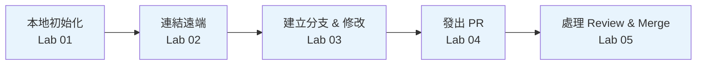

# Git 入門課程：從零到第一個 PR

本課程帶領完全沒有版本控制經驗的新人，透過一系列手把手實作 Lab，在一個工作天內完成本地初始化、分支操作、遠端推送，並成功發出第一個 Pull Request。

---

## 課程設計主旨

本課程遵循「做中學」原則：每個 Lab 都以一個**可以立即執行並觀察結果**的小任務為起點，讓學員先看到「Git 在做什麼」，再用流程回推「為什麼這樣設計」。不堆大段理論，理論只在學員需要它解釋「為什麼出錯」時才出現。

---

## 使用環境

在開始第一個 Lab 之前，請確認以下環境已準備好：

| 項目 | 確認指令 | 期待結果 |
| --- | --- | --- |
| Git 已安裝 | `git --version` | `git version 2.x.x` |
| 使用者名稱已設定 | `git config --global user.name` | 顯示你的名字 |
| 使用者 Email 已設定 | `git config --global user.email` | 顯示你的 Email |
| GitHub 帳號 | 登入 [github.com](https://github.com) | 能看到個人首頁 |
| SSH 金鑰已設定（推薦）或使用 HTTPS Token | `ssh -T git@github.com` | `Hi <username>! You've successfully authenticated.` |

若環境尚未設定，請先完成 [補充說明：環境初始設定](supplement-setup.md)。

---

## 課程路線

以下為建議學習順序，請依序完成每個 Lab：

1. [Lab 00：Git 核心名詞導讀](00-git-concepts.md)
   - Repository、Commit、Branch、Remote、PR 等術語，附白話說明與常見誤解
2. [Lab 01：建立第一個本地 Repository](01-init-repo.md)
   - `git init`、`git add`、`git commit`，完成第一次本地 commit
3. [Lab 02：連結遠端並推送](02-remote-push.md)
   - `git remote add`、`git push`，把本地 repo 推上 GitHub
4. [Lab 03：建立分支並進行變更](03-branch-and-change.md)
   - `git checkout -b`、`git add`、`git commit`，在 feature branch 上做修改
5. [Lab 04：發出第一個 Pull Request](04-pull-request.md)
   - `git push origin <branch>`，在 GitHub 介面建立 PR、填寫描述、指定 Reviewer
6. [Lab 05：處理 Review 意見與 Merge](05-review-and-merge.md)
   - 回應 comment、補推 commit、完成 Merge，並清除已合併的分支
7. [99-速查表：Git 常用指令與常見錯誤](99-cheatsheet.md)
   - 隨時查用的指令索引與錯誤排查表

---

## 每個 Lab 的操作原則

- **先執行指令，再看說明**：步驟寫在前面，WHY 解釋附在步驟後，不要跳著看
- **出現紅色錯誤訊息不要慌**：先看「常見錯誤」章節，大多數問題都有對應解法
- **每個 Lab 都有「完成檢查」**：做完後用 checklist 自我確認，有不懂的概念再回頭看
- **練習題才是真正的學習**：照著步驟做完只是熟悉流程，練習題才讓你真正理解 Git 在做什麼
- **不要跳過 Lab 00**：看起來都是文字，但它讓後面五個 Lab 的指令變得有意義

---

## 完成課程後你應該能做到

- 在本地建立 Git repository，並完成第一次 `commit`
- 把本地 repository 推送到 GitHub 上的遠端 repository
- 建立 feature branch，在上面進行修改並 `push` 到遠端
- 在 GitHub 介面發出 Pull Request，填寫清楚的描述與指定 Reviewer
- 根據 Review 意見補推 commit，並在 Merge 後清除 branch
- 遇到常見 Git 錯誤時，知道該往哪個方向排查

---

## 課程地圖（整體流程一覽）

`Lab 01–02` 建立你與遠端的連線基礎，`Lab 03–04` 是日常開發最常走的主線流程，`Lab 05` 完成整個協作循環。

---

> 有任何疑問，先查 [99-速查表](99-cheatsheet.md)，再找你的 Buddy 或在 team channel 提問。
