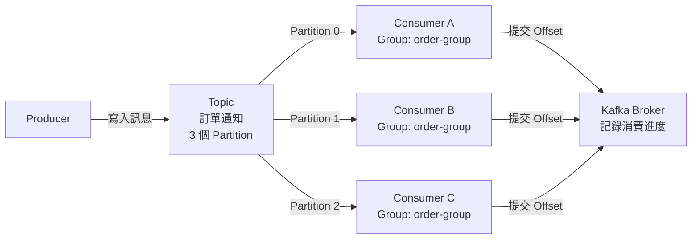
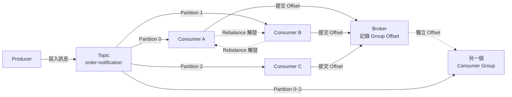

# Lab 01：Kafka Consumer Group 機制

目標：透過實際操作，理解 Consumer Group 如何讓多個消費者協作分攤訊息負載，並觀察 Partition 分配與 Rebalance 行為。

預估時間：60 分鐘。

---

## 你會做出什麼



`Producer` 持續寫入訊息到 `Topic`，`Topic` 被切成 3 個 `Partition`，`Consumer Group` 內的 3 個 `Consumer` 各自負責一個 `Partition`，`Broker` 記錄每個 Consumer 讀到哪一筆（`Offset`）。

---

## Step 1：啟動本地 Kafka 環境

1. 確認 Docker 已啟動，執行以下指令拉起 Kafka：

   ```bash
   docker compose up -d
   ```

   使用以下 `docker-compose.yml`（若還沒有，請建立在任意空目錄）：

   ```yaml
   version: "3"
   services:
     zookeeper:
       image: confluentinc/cp-zookeeper:7.5.0
       environment:
         ZOOKEEPER_CLIENT_PORT: 2181
     kafka:
       image: confluentinc/cp-kafka:7.5.0
       depends_on:
         - zookeeper
       ports:
         - "9092:9092"
       environment:
         KAFKA_BROKER_ID: 1
         KAFKA_ZOOKEEPER_CONNECT: zookeeper:2181
         KAFKA_ADVERTISED_LISTENERS: PLAINTEXT://localhost:9092
         KAFKA_OFFSETS_TOPIC_REPLICATION_FACTOR: 1
   ```

2. 確認 Kafka 已就緒：

   ```bash
   docker compose ps
   ```

   看到 `kafka` 和 `zookeeper` 都是 `Up` 狀態即可繼續。

說明：Kafka 本身需要 `ZooKeeper` 來管理叢集元資料（在舊版架構下）。`KAFKA_ADVERTISED_LISTENERS` 設定的是 Client 連接 Broker 的地址，務必與你的 host 一致，否則 Producer / Consumer 會連不上。

---

## Step 2：建立 Topic（含 3 個 Partition）

1. 進入 Kafka container：

   ```bash
   docker exec -it <kafka-container-name> bash
   ```

   `<kafka-container-name>` 通常是 `<資料夾名稱>-kafka-1`，可用 `docker compose ps` 確認。

2. 建立 Topic：

   ```bash
   kafka-topics --bootstrap-server localhost:9092 \
     --create \
     --topic order-notification \
     --partitions 3 \
     --replication-factor 1
   ```

3. 確認 Topic 建立成功：

   ```bash
   kafka-topics --bootstrap-server localhost:9092 \
     --describe \
     --topic order-notification
   ```

   你應該會看到 `PartitionCount: 3` 的輸出。

說明：`--partitions 3` 決定這個 Topic 最多可以讓幾個 Consumer 並行消費。Partition 數量是 Consumer 並行上限的關鍵，**Consumer 數量超過 Partition 數時，多出來的 Consumer 會閒置**，不會分到任何 Partition。

---

## Step 3：啟動 Consumer Group（3 個 Consumer）

本步驟需要開啟 **3 個終端機視窗**，分別代表 Consumer A、B、C。

**終端機 1（Consumer A）：**

```bash
docker exec -it <kafka-container-name> bash
kafka-console-consumer --bootstrap-server localhost:9092 \
  --topic order-notification \
  --group order-group
```

**終端機 2（Consumer B）：**

```bash
docker exec -it <kafka-container-name> bash
kafka-console-consumer --bootstrap-server localhost:9092 \
  --topic order-notification \
  --group order-group
```

**終端機 3（Consumer C）：**

```bash
docker exec -it <kafka-container-name> bash
kafka-console-consumer --bootstrap-server localhost:9092 \
  --topic order-notification \
  --group order-group
```

說明：三個指令都指定了相同的 `--group order-group`，這代表它們屬於同一個 `Consumer Group`。Kafka 會自動將 3 個 Partition 各分配給一個 Consumer，這個分配過程稱為 **Rebalance**。

---

## Step 4：確認 Partition 分配狀況

在 Kafka container 內執行（另開一個終端機）：

```bash
kafka-consumer-groups --bootstrap-server localhost:9092 \
  --describe \
  --group order-group
```

你應該看到類似以下輸出：

| TOPIC | PARTITION | CURRENT-OFFSET | LOG-END-OFFSET | LAG | CONSUMER-ID |
|-------|-----------|----------------|----------------|-----|-------------|
| order-notification | 0 | 0 | 0 | 0 | consumer-A-xxx |
| order-notification | 1 | 0 | 0 | 0 | consumer-B-xxx |
| order-notification | 2 | 0 | 0 | 0 | consumer-C-xxx |

說明：

- `CURRENT-OFFSET`：這個 Consumer 目前讀到第幾筆。
- `LOG-END-OFFSET`：Partition 最新一筆訊息的位置。
- `LAG`：還沒讀的訊息數量（`LOG-END-OFFSET - CURRENT-OFFSET`）。LAG 增加代表 Consumer 來不及消費。

---

## Step 5：發送訊息並觀察分配行為

1. 開啟 Producer（另開一個終端機）：

   ```bash
   docker exec -it <kafka-container-name> bash
   kafka-console-producer --bootstrap-server localhost:9092 \
     --topic order-notification
   ```

2. 輸入以下訊息（每行按 Enter 送出）：

   ```
   order-001
   order-002
   order-003
   order-004
   order-005
   order-006
   ```

3. 觀察 3 個 Consumer 終端機，你會看到訊息被分散接收，**每筆訊息只會出現在其中一個 Consumer**。

說明：Kafka 根據訊息的 **Key** 決定寫入哪個 Partition（無 Key 時用 Round-Robin 或 Sticky Partitioner）。同一個 Partition 的訊息只會交給同一個 Consumer，所以**順序保證是 Partition 層級，不是 Topic 層級**。

---

## Step 6：觀察 Rebalance（模擬 Consumer 離線）

1. **關閉終端機 3**（按 `Ctrl+C` 停止 Consumer C）。

2. 等待約 10 秒後，重新查詢分配狀況：

   ```bash
   kafka-consumer-groups --bootstrap-server localhost:9092 \
     --describe \
     --group order-group
   ```

3. 你應該看到原本屬於 Consumer C 的 Partition 2 已被重新分配給 Consumer A 或 Consumer B。

4. 再次透過 Producer 傳送幾筆訊息，確認剩下兩個 Consumer 都有收到訊息。

說明：當 Consumer 離線或加入時，Kafka Broker 會觸發 **Rebalance**，重新分配 Partition。Rebalance 期間所有 Consumer 會暫停消費，分配完成後才繼續。這是 Consumer Group 的核心機制，確保訊息在 Consumer 異動時不會丟失。

---

## 練習題

### 練習 1：Consumer 數量超過 Partition 數

現在 Topic 有 3 個 Partition，試著啟動第 4 個 Consumer，同樣指定 `--group order-group`。

確認方式：

1. 執行 `kafka-consumer-groups --describe --group order-group`。
2. 確認第 4 個 Consumer 的 `PARTITION` 欄位顯示為 `-`（沒有分配到任何 Partition）。
3. 透過 Producer 傳送訊息，確認第 4 個 Consumer 的終端機**沒有收到任何訊息**。

---

### 練習 2：兩個不同 Group 獨立消費

啟動另一個 Consumer，但指定不同的 Group：

```bash
kafka-console-consumer --bootstrap-server localhost:9092 \
  --topic order-notification \
  --group report-group \
  --from-beginning
```

確認方式：

1. 新的 Consumer 應該能讀取到 `order-notification` 的**所有歷史訊息**（`--from-beginning`）。
2. 執行以下指令，確認兩個 Group 的 Offset 是獨立記錄的：

   ```bash
   kafka-consumer-groups --bootstrap-server localhost:9092 --list
   ```

   你應該看到 `order-group` 和 `report-group` 各自獨立存在。

說明：不同 `Consumer Group` 的 Offset 完全獨立，同一份訊息可以被多個 Group 各自完整消費。這是 Kafka 與傳統 Message Queue 最大的差異之一。

---

### 練習 3：觀察 LAG 的變化

1. 先停止所有 Consumer（關閉所有消費終端機）。
2. 透過 Producer 快速傳送 20 筆訊息。
3. 執行 `kafka-consumer-groups --describe --group order-group`，觀察 `LAG` 欄位的數值。
4. 重新啟動一個 Consumer，過幾秒後再次查詢，確認 LAG 下降。

確認方式：

1. 停止 Consumer 後，`LAG` 應顯示為 20（或接近 20）。
2. Consumer 重新啟動消費後，`LAG` 應逐漸歸零。

---

## 完成檢查

- 你知道 `Consumer Group` 的用途：讓多個 Consumer 協作分攤同一個 Topic 的訊息負載。
- 你能在指令輸出中找到 `PARTITION`、`CURRENT-OFFSET`、`LAG` 欄位並解讀其意義。
- 你知道 `Partition` 數量是 Consumer 並行消費的上限，超過的 Consumer 會閒置。
- 你知道 `Rebalance` 是什麼，以及它在什麼情況下觸發。
- 你知道不同 `Consumer Group` 的 Offset 獨立，同一份訊息可以被多個 Group 消費。
- 你能區分「Topic 層級的訊息順序」與「Partition 層級的訊息順序」。

---

## 常見錯誤

- `Connection refused` 或 `LEADER_NOT_AVAILABLE`：Kafka 還未完全就緒，等待 10~20 秒再重試。確認 `docker compose ps` 顯示 Kafka 為 `Up` 狀態。
- Consumer 啟動後沒有收到任何訊息：確認 `--from-beginning` 有無加入。預設 Consumer 只讀新訊息，若訊息已在 Consumer 啟動前傳送，需加 `--from-beginning`。
- 所有訊息都集中在同一個 Consumer：Producer 沒有指定 Key 時，部分版本使用 Sticky Partitioner，短時間內訊息會集中在同一個 Partition。傳送更多訊息後分配會趨於平均。
- `consumer group 'order-group' does not exist`：Consumer 尚未真正連上並建立 Group。確認 Consumer 正在執行，且 Group 名稱拼寫正確。
- Rebalance 後 LAG 突然增加：Rebalance 期間 Consumer 暫停消費，Producer 仍持續寫入，導致短暫 LAG 上升。這是正常現象，Rebalance 完成後 Consumer 會追上。

---

## 本 Lab 的學習重點回顧

這個 Lab 建立的是一條 **Producer → Topic（多 Partition）→ Consumer Group（協作消費）** 的完整資料流：



整個流程的意思是：

1. `Producer` 將訊息寫入 `Topic`，Kafka 根據 Key 或 Round-Robin 決定寫入哪個 `Partition`。
2. 同一個 `Consumer Group` 內的多個 `Consumer` 各自負責一個或多個 `Partition`，**同一筆訊息只會被 Group 內的一個 Consumer 消費**。
3. 當 Consumer 加入或離開時，`Broker` 觸發 `Rebalance`，重新分配 `Partition`，確保所有 Partition 都有 Consumer 負責。
4. `Broker` 為每個 `Consumer Group` 獨立記錄 `Offset`，不同 Group 消費同一個 Topic 互不影響。

做完後你要理解：

- **Partition 是並行的單位**：Consumer 並行數量上限由 Partition 數量決定，不是由 Consumer 數量決定。
- **Consumer Group 是隔離的單位**：不同 Group 的進度（Offset）完全獨立，適合用來隔離不同業務系統（例如：訂單處理系統與報表系統各自訂閱同一個 Topic）。
- **Rebalance 是自動容錯機制**：Consumer 異常離線時，Kafka 會自動將其負責的 Partition 轉移給其他 Consumer，不需要人工介入，但期間會有短暫暫停，實際生產環境需關注 Rebalance 頻率與持續時間。
