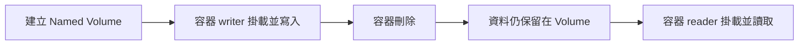

# Lab 01：Docker Volume 的使用方式

目標：學會建立與掛載 Docker Volume，讓容器資料在容器重啟或刪除後仍然保留。

預估時間：40 分鐘。

---

## 你會做出什麼



`Named Volume` 是 Docker 管理的持久化儲存空間，與容器的生命週期無關。容器刪除後資料不消失，新容器可以掛載同一個 Volume 繼續讀取。

---

## 課程環境說明

本 Lab 使用 `docker run` 直接操作容器，不需要 `docker-compose.yaml`。

若你在課程 repo 中看到 `docker-compose.yaml`，該檔案放在 **repo 根目錄**（和 `docs/` 同層），不在 `docs/` 裡面。Lab 中的所有環境指令都從 **repo 根目錄**執行。

---

## Step 1：確認環境

1. 開啟終端機，確認 Docker 已安裝並執行：

   ```
   docker --version
   docker info
   ```

2. 確認輸出包含版本號與 Server 資訊，未出現 `Cannot connect to the Docker daemon` 即正常。

說明：`docker info` 會連線到 Docker Daemon，若 Daemon 未啟動會直接報錯，是最快的環境確認方式。

---

## Step 2：建立 Named Volume

1. 建立一個命名 Volume：

   ```
   docker volume create my-data
   ```

2. 確認 Volume 已建立：

   ```
   docker volume ls
   ```

3. 查看 Volume 詳細資訊：

   ```
   docker volume inspect my-data
   ```

   重點欄位：

   | 欄位 | 說明 |
   | --- | --- |
   | `Name` | Volume 的識別名稱 |
   | `Driver` | 預設為 `local`，資料存在本機 |
   | `Mountpoint` | Docker 管理的實際儲存路徑 |

說明：Named Volume 由 Docker 統一管理，名稱固定。不同容器可用同一名稱掛載同一份資料，比 Bind Mount 更適合多容器共享。

---

## Step 3：將 Volume 掛載到容器並寫入資料

1. 啟動一個 Alpine 容器，將 `my-data` 掛載到容器內的 `/data`：

   ```
   docker run -it --name writer --mount source=my-data,target=/data alpine sh
   ```

2. 進入容器後，寫入一個檔案：

   ```
   echo "Hello from Docker Volume" > /data/hello.txt
   cat /data/hello.txt
   ```

3. 確認輸出正確後，離開容器：

   ```
   exit
   ```

說明：`--mount source=<volume-name>,target=<container-path>` 是掛載 Volume 的標準語法。`target` 若不存在，Docker 會自動建立。

---

## Step 4：驗證資料在容器刪除後仍保留

1. 刪除容器：

   ```
   docker rm writer
   ```

2. 確認容器已刪除（清單中不應出現 `writer`）：

   ```
   docker ps -a
   ```

3. 確認 Volume 仍然存在：

   ```
   docker volume ls
   ```

說明：容器刪除不影響 Volume 的資料。Volume 的生命週期獨立於容器之外，需手動 `docker volume rm` 才會刪除。

---

## Step 5：用新容器掛載同一 Volume 並讀取資料

1. 啟動新容器，掛載同一個 `my-data`：

   ```
   docker run --rm --name reader --mount source=my-data,target=/data alpine cat /data/hello.txt
   ```

2. 確認終端機輸出：

   ```
   Hello from Docker Volume
   ```

說明：`--rm` 讓容器結束後自動刪除。這個步驟驗證了新容器可以讀取前一個容器留下的資料。

---

## Step 6：使用 `-v` 簡寫語法

除了 `--mount`，Docker 支援更簡短的 `-v` 語法。

1. 使用 `-v` 掛載同一個 Volume：

   ```
   docker run --rm -v my-data:/data alpine ls /data
   ```

2. 確認輸出中出現 `hello.txt`。

   | `--mount` 語法 | `-v` 語法 |
   | --- | --- |
   | `--mount source=my-data,target=/data` | `-v my-data:/data` |

說明：`-v` 適合快速測試，`--mount` 參數更明確，適合需要 `readonly` 等進階選項的情境。

---

## Step 7：清除 Volume

1. 確認沒有容器在使用 `my-data`：

   ```
   docker ps -a
   ```

2. 刪除 Volume：

   ```
   docker volume rm my-data
   ```

3. 確認已刪除：

   ```
   docker volume ls
   ```

說明：若有容器（含已停止的）仍掛載該 Volume，`docker volume rm` 會報錯。需先 `docker rm <container>` 再刪除 Volume，或用 `docker volume prune` 批次清除未使用的 Volume。

---

## 練習題

### 練習 1：觀察唯讀掛載的行為

**開始前請確認**：`my-data` Volume 已透過 Step 2 重新建立，且 `/data/hello.txt` 已存在（若尚未執行，請先完成 Step 2 至 Step 4）。

情境說明：有些容器只應能讀取 Volume 中的資料，不允許寫入。Docker 支援以唯讀模式掛載 Volume。

1. 使用唯讀模式啟動容器：

   ```
   docker run --rm --mount source=my-data,target=/data,readonly alpine sh -c "cat /data/hello.txt && echo 'try write' > /data/test.txt"
   ```

2. 觀察輸出：`cat` 應成功，寫入應出現 `Read-only file system` 錯誤。

確認方式：

1. 終端機輸出 `Hello from Docker Volume`（讀取成功）。
2. 出現 `sh: can't create /data/test.txt: Read-only file system`（寫入被拒絕）。

---

### 練習 2：在 docker-compose.yaml 中使用 Named Volume

**開始前請確認**：練習 1 的容器已自動刪除（使用了 `--rm`），`my-data` Volume 中的 `hello.txt` 仍然保留，不需清除。

情境說明：實際專案通常用 `docker-compose.yaml` 管理服務與 Volume。這份 `docker-compose.yaml` 應放在 **repo 根目錄**（與 `docs/` 同層），不要放在 `docs/` 內。

1. 在 repo 根目錄建立 `docker-compose.yaml`：

   ```yaml
   services:
     app:
       image: alpine
       command: sh -c "cat /data/hello.txt"
       volumes:
         - my-data:/data

   volumes:
     my-data:
       external: true
   ```

2. 從 repo 根目錄執行（**不要 `cd docs/` 後執行**）：

   ```
   docker compose up
   ```

確認方式：

1. 終端機輸出 `Hello from Docker Volume`，表示 Compose 服務正確掛載了現有的 Named Volume。
2. 執行完成後，執行 `docker compose down` 清除服務（Volume 不會被刪除）。

---

## 完成檢查

- 你知道 `docker volume create` 與 `docker volume ls` 的用途。
- 你能用 `--mount` 與 `-v` 兩種語法將 Named Volume 掛載到容器。
- 你知道刪除容器不會刪除 Volume，Volume 的生命週期獨立管理。
- 你知道如何以唯讀模式掛載 Volume 保護資料。
- 你知道 `docker-compose.yaml` 屬於 repo 根目錄，不放在 `docs/` 內。

---

## 常見錯誤

- `No such volume: my-data`：執行 `docker run` 時 Volume 名稱拼錯，或尚未建立。先執行 `docker volume create my-data`。
- `conflict: unable to remove volume: volume is in use`：有容器（含已停止的）仍掛載該 Volume。執行 `docker ps -a` 找出容器，`docker rm <container-id>` 刪除後重試。
- `mount path must be absolute`：`-v` 語法的 `target` 路徑必須以 `/` 開頭，例如 `/data` 而非 `data`。
- `docker compose up` 找不到 `docker-compose.yaml`：確認你在 repo 根目錄執行，而不是在 `docs/` 目錄內。

---

## 本 Lab 的學習重點回顧

這個 Lab 建立的是「Volume 持久化資料」的完整流程：

```mermaid
flowchart LR
    A[Named Volume] -- 掛載 --> B[容器 writer]
    B -- 寫入 --> C[/data/hello.txt]
    C -- 儲存於 --> A
    A -- 掛載 --> D[容器 reader]
    D -- 讀取 --> C
```

整個流程的意思是：

1. `Named Volume` 是 Docker 管理的持久化儲存空間，建立後獨立存在，不依附於任何容器。
2. 容器 `writer` 掛載 Volume 後，寫入的檔案實際存在 Docker 管理的 `Mountpoint` 位置。
3. 即使容器 `writer` 被刪除，`/data/hello.txt` 仍完整保留在 Volume 中。
4. 容器 `reader` 掛載同一個 Volume，可以直接讀取前一個容器留下的資料。

做完後你要理解：

- **Volume 的生命週期獨立於容器**：容器刪除不代表資料消失，需要手動 `docker volume rm` 才會清除。
- **Named Volume 適合跨容器共享資料**：資料庫資料目錄、設定檔、上傳檔案等都適合用 Named Volume。
- **`docker-compose.yaml` 屬於 repo 根目錄**：它是課程的環境入口，與教學文件的 `docs/` 目錄是平行關係，不能放在 `docs/` 內。
- **`--mount` 比 `-v` 更明確**：production 環境建議用 `--mount`，可讀性高且支援 `readonly` 等進階選項。
