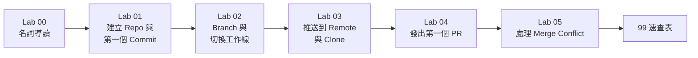

# Git 入門課程：從零到推出第一個 PR

本課程以「做中學」為核心原則，帶領完全沒有 Git 經驗的新人，從環境設定出發，一路完成實際的 Pull Request，建立可立即應用於日常開發的版控工作流程。

---

## 課程設計主旨

本課程採用「先動手，再解釋」的教學策略：

- 每個 Lab 都有一個**明確可完成的終點**（例如「推出第一個 commit」、「發出第一個 PR」），讓學員在操作前先知道自己要做出什麼。
- 操作步驟結束後，才補充背後的概念與原因（WHY）。
- 不在早期 Lab 堆砌理論，概念說明只在「學員已親眼看到現象」後才介紹。
- 每個 Lab 的練習題從「改一個參數觀察行為差異」出發，鞏固核心觀念。

---

## 使用環境

開始課程前，請確認以下工具已安裝：

| 工具 | 確認指令 | 建議版本 |
| --- | --- | --- |
| `git` | `git --version` | 2.40 以上 |
| `gh`（GitHub CLI） | `gh --version` | 2.40 以上 |
| 文字編輯器 | VS Code 建議安裝 [GitLens 擴充套件](https://marketplace.visualstudio.com/items?itemName=eamodio.gitlens) | 任意 |

**帳號確認：**

```bash
# 確認 Git 已設定使用者資訊
git config --global user.name
git config --global user.email

# 確認已登入 GitHub CLI
gh auth status
```

若尚未設定，請執行：

```bash
git config --global user.name "你的名字"
git config --global user.email "你的 Email"
gh auth login
```

---

## 課程路線



| 順序 | 文件 | 主題 | 預估時間 |
| --- | --- | --- | --- |
| Lab 00 | [00-git-glossary.md](00-git-glossary.md) | Git 核心名詞導讀 | 20 分鐘 |
| Lab 01 | [01-first-commit.md](01-first-commit.md) | 建立 Repo 與第一個 Commit | 30 分鐘 |
| Lab 02 | [02-branch.md](02-branch.md) | Branch 與切換工作線 | 30 分鐘 |
| Lab 03 | [03-remote-push-clone.md](03-remote-push-clone.md) | 推送到 Remote 與 Clone | 30 分鐘 |
| Lab 04 | [04-first-pr.md](04-first-pr.md) | 發出第一個 PR | 40 分鐘 |
| Lab 05 | [05-merge-conflict.md](05-merge-conflict.md) | 處理 Merge Conflict | 40 分鐘 |
| 速查表 | [99-cheatsheet.md](99-cheatsheet.md) | Git 常用指令速查 | 隨時查閱 |

---

## 每個 Lab 的操作原則

- 每個 Lab **獨立可執行**，從上一個 Lab 結束的狀態直接銜接，銜接點在每個 Lab 開頭會明確說明。
- 遇到不懂的名詞，先繼續操作，完成 Step 後再回頭對照 [Lab 00 名詞導讀](00-git-glossary.md)。
- 每個 Step 結束後，**親眼確認終端機輸出或 GitHub 頁面的狀態變化**，再進入下一步。
- 練習題為**建議完成**，跳過不影響後續 Lab，但強烈建議第一次學習時全部做完。
- 遇到錯誤，先查本 Lab 的「常見錯誤」章節，再查 [99 速查表](99-cheatsheet.md)。

---

## 完成課程後你應該能做到

- 在本機建立 Git repository 並追蹤檔案變更。
- 使用 `git commit` 記錄有意義的版本快照，並撰寫清楚的 commit message。
- 建立 branch 在獨立工作線上開發，不干擾主線。
- 將本機的 branch 推送到 GitHub remote repository。
- 在 GitHub 發出 Pull Request，描述這次變更的目的，等待 review。
- 遇到 Merge Conflict 時，理解衝突來源並手動解決，完成合併。
- 使用速查表快速找到正確指令，不需要死背。

---

## 課程後的下一步

完成本課程後，建議繼續學習：

- **Git Flow / GitHub Flow**：團隊協作的 branching 策略。
- **`git rebase` 與 `git stash`**：進階版控技巧。
- **CI/CD 整合**：PR 觸發自動測試與部署流程。
- **Code Review 最佳實踐**：如何給出有建設性的 review 意見。
