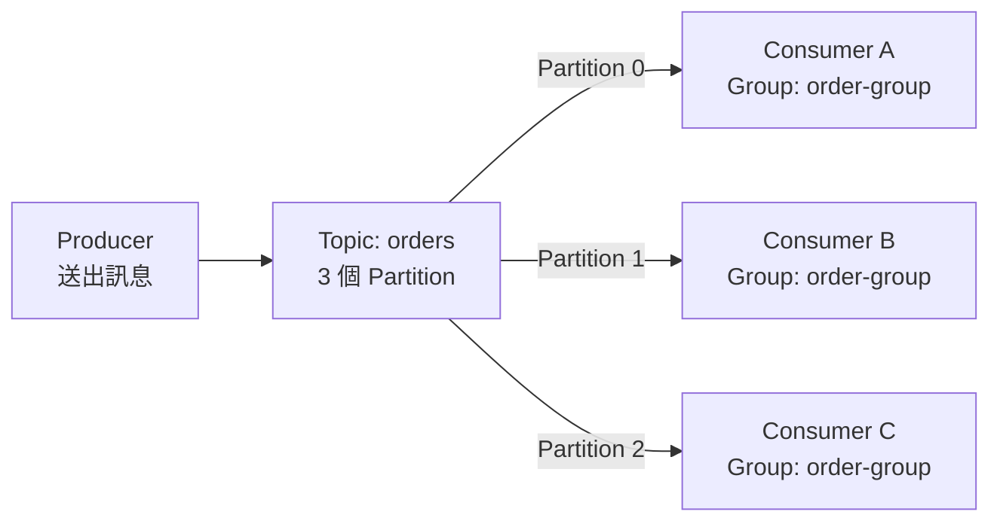
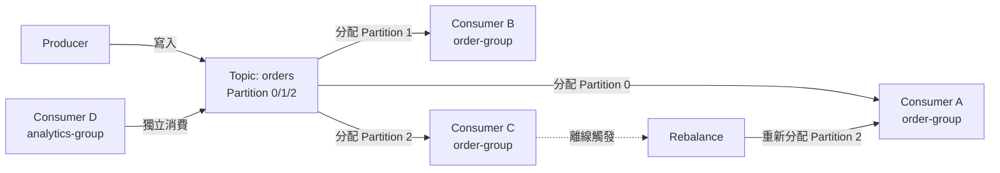

# Lab 01：認識 Consumer Group — 讓多個消費者一起分工處理訊息

目標：透過實際啟動 Producer、建立多個 Consumer，觀察 Kafka Consumer Group 如何將 Partition 分配給不同 Consumer，理解為什麼 Consumer Group 是 Kafka 擴展消費能力的核心機制。

預估時間：60 分鐘。

---

## 你會做出什麼



`Producer` 將訊息寫入 Topic，Topic 底下有 3 個 `Partition`。同一個 `Consumer Group` 內的三個 Consumer 各自負責一個 Partition，平行消費訊息而互不重複。

---

## Step 1：確認環境並啟動 Kafka

1. 確認 Docker 已安裝並執行：
   ```
   docker --version
   docker compose version
   ```

2. 下載課程用的 `docker-compose.yml`（由講師提供），放在任意工作目錄，例如 `~/kafka-lab/`。

3. 在該目錄啟動 Kafka：
   ```
   docker compose up -d
   ```

4. 確認容器正常運行：
   ```
   docker compose ps
   ```
   應看到 `kafka` 與 `zookeeper`（或 KRaft 模式下只有 `kafka`）狀態為 `Up`。

說明：本 Lab 使用 Docker 快速搭建本地 Kafka 環境，無需自行安裝 Java 或下載 Kafka 二進位檔。如果你的環境已有現成 Kafka，可跳過此步驟，但請確認 Broker 地址為 `localhost:9092`。

---

## Step 2：建立有 3 個 Partition 的 Topic

1. 進入 Kafka 容器的 shell：
   ```
   docker compose exec kafka bash
   ```

2. 在容器內，建立名為 `orders` 的 Topic，設定 3 個 Partition：
   ```
   kafka-topics.sh \
     --bootstrap-server localhost:9092 \
     --create \
     --topic orders \
     --partitions 3 \
     --replication-factor 1
   ```

3. 確認 Topic 建立成功：
   ```
   kafka-topics.sh \
     --bootstrap-server localhost:9092 \
     --describe \
     --topic orders
   ```
   應看到 `PartitionCount: 3` 的輸出。

4. 輸入 `exit` 離開容器 shell，回到本機終端機。

說明：`--partitions 3` 決定這個 Topic 最多能有幾個 Consumer 同時平行消費。Partition 數量是 Kafka 水平擴展的關鍵——Consumer 數量不能超過 Partition 數，多出來的 Consumer 會閒置。

---

## Step 3：以 Consumer Group 啟動三個 Consumer

這個步驟需要開啟 **三個獨立的終端機視窗**，每個視窗各執行一個 Consumer，全部指定相同的 `group.id`。

**終端機視窗 1（Consumer A）**

進入 Kafka 容器並執行：
```
docker compose exec kafka \
  kafka-console-consumer.sh \
  --bootstrap-server localhost:9092 \
  --topic orders \
  --group order-group
```

**終端機視窗 2（Consumer B）**

同樣進入容器執行（另開一個視窗）：
```
docker compose exec kafka \
  kafka-console-consumer.sh \
  --bootstrap-server localhost:9092 \
  --topic orders \
  --group order-group
```

**終端機視窗 3（Consumer C）**

同上，再開一個視窗執行：
```
docker compose exec kafka \
  kafka-console-consumer.sh \
  --bootstrap-server localhost:9092 \
  --topic orders \
  --group order-group
```

三個 Consumer 都啟動後，暫時先不要關閉，讓它們保持等待狀態。

說明：三個 Consumer 使用相同的 `--group order-group`，Kafka 的 Group Coordinator 會自動把 3 個 Partition 各自分配給一個 Consumer（稱為 Rebalance）。若你只啟動兩個 Consumer，其中一個會分配到 2 個 Partition；若啟動四個，第四個將閒置。

---

## Step 4：用 Producer 送出訊息並觀察分配結果

1. 開啟**第四個終端機視窗**，進入容器並啟動 Producer：
   ```
   docker compose exec kafka \
     kafka-console-producer.sh \
     --bootstrap-server localhost:9092 \
     --topic orders
   ```

2. 依序輸入以下訊息，每行按 Enter 送出：
   ```
   order-001
   order-002
   order-003
   order-004
   order-005
   order-006
   ```

3. 觀察三個 Consumer 視窗，每筆訊息只會出現在其中**一個** Consumer 視窗，不會同時出現在多個視窗。

說明：Kafka 根據訊息的 `key` 決定要寫入哪個 Partition（無 key 時輪流或隨機分配）。每個 Partition 同一時間只能被 Group 內的一個 Consumer 讀取，這保證了相同 Partition 的訊息被順序處理。

---

## Step 5：觀察 Consumer Group 狀態

1. 開啟**第五個終端機視窗**，進入容器查詢 Group 狀態：
   ```
   docker compose exec kafka \
     kafka-consumer-groups.sh \
     --bootstrap-server localhost:9092 \
     --describe \
     --group order-group
   ```

2. 觀察輸出表格中的欄位：

   | 欄位 | 意義 |
   | --- | --- |
   | `PARTITION` | Partition 編號（0、1、2） |
   | `CURRENT-OFFSET` | 該 Partition 已消費到的位置 |
   | `LOG-END-OFFSET` | 該 Partition 最新訊息的位置 |
   | `LAG` | 尚未消費的訊息數（= LOG-END-OFFSET - CURRENT-OFFSET） |
   | `CONSUMER-ID` | 目前負責該 Partition 的 Consumer 識別碼 |

3. 確認 `LAG` 欄位全部為 `0`，代表所有訊息都已被消費。

說明：`LAG` 是監控 Consumer 健康狀態最重要的指標。當 LAG 持續增加，代表 Consumer 消費速度跟不上 Producer 的生產速度，需要增加 Consumer 數量或優化消費邏輯。

---

## Step 6：模擬 Consumer 離線觀察 Rebalance

1. **關閉終端機視窗 3**（Consumer C）：直接關閉視窗或按 `Ctrl+C`。

2. 等待約 10 秒後，再次查詢 Group 狀態：
   ```
   docker compose exec kafka \
     kafka-consumer-groups.sh \
     --bootstrap-server localhost:9092 \
     --describe \
     --group order-group
   ```

3. 觀察 `CONSUMER-ID` 欄位：原本由 Consumer C 負責的 Partition，現在應該已轉移給 Consumer A 或 Consumer B。

說明：當 Consumer 因當機或網路中斷離線時，Kafka 的 Group Coordinator 會在偵測到心跳逾時後，自動觸發 Rebalance，將孤立的 Partition 重新分配給仍在線的 Consumer。這是 Kafka 實現高可用消費的核心能力，不需要人工介入。

---

## 練習題

### 練習 1：啟動第四個 Consumer 觀察閒置行為

**延續 Step 6 的狀態**：目前 `order-group` 中有 Consumer A 和 Consumer B 各自負責 Partition（Consumer C 已離線），Topic `orders` 有 3 個 Partition。請**不要清除**任何現有設定，直接在這個狀態上新增 Consumer。

情境：你的團隊決定增加一個備援 Consumer，希望它能立刻開始分擔工作，但 Topic 的 Partition 數量沒有增加。

1. 開啟第六個終端機視窗，使用相同的 `--group order-group` 再啟動一個 Consumer。
2. 執行 `kafka-consumer-groups.sh --describe --group order-group`，觀察這第四個 Consumer 的 `PARTITION` 欄位。

確認方式：

1. 查詢 Group 狀態，確認新 Consumer 的 `CONSUMER-ID` 有出現在輸出中。
2. 觀察新 Consumer 分配到的 Partition 數量是否為 `0`（因為 3 個 Partition 已被 2 個 Consumer 佔滿）。
3. 在 Producer 視窗再送出幾筆訊息，確認新 Consumer 視窗**沒有**收到任何訊息。

---

### 練習 2：使用不同 Group 觀察獨立消費

**執行此練習前**：請先停止所有練習 1 新增的第四個 Consumer（按 `Ctrl+C`），其餘 Consumer A 和 Consumer B 維持運行。

情境：另一個業務團隊也需要消費 `orders` Topic 的訊息，但他們要獨立處理，不能影響 `order-group` 已消費的進度。

1. 開啟一個新終端機視窗，啟動一個使用不同 Group 的 Consumer：
   ```
   docker compose exec kafka \
     kafka-console-consumer.sh \
     --bootstrap-server localhost:9092 \
     --topic orders \
     --group analytics-group \
     --from-beginning
   ```
2. 在 Producer 視窗再送出幾筆新訊息。

確認方式：

1. 觀察 `analytics-group` 的 Consumer 視窗是否收到訊息。
2. 執行以下指令，確認兩個 Group 的 `LAG` 各自獨立：
   ```
   docker compose exec kafka \
     kafka-consumer-groups.sh \
     --bootstrap-server localhost:9092 \
     --describe \
     --group order-group

   docker compose exec kafka \
     kafka-consumer-groups.sh \
     --bootstrap-server localhost:9092 \
     --describe \
     --group analytics-group
   ```
3. 確認兩個 Group 有各自獨立的 `CURRENT-OFFSET`，互不干擾。

---

## 完成檢查

- 你知道 `Consumer Group` 的用途：讓多個 Consumer 協同消費同一個 Topic，並自動分工。
- 你能解釋為什麼 Consumer 數量超過 Partition 數時，多出來的 Consumer 會閒置。
- 你知道 `Rebalance` 是什麼，以及它在什麼時候會被觸發。
- 你能在 `kafka-consumer-groups.sh --describe` 的輸出中找到 `LAG`，並解釋它代表什麼。
- 你知道不同 `group.id` 的 Consumer Group 消費同一個 Topic 時，彼此的 Offset 是獨立的，不會互相影響。

---

## 常見錯誤

- **Consumer 啟動後立刻退出，沒有等待訊息**：通常是 `--bootstrap-server` 地址錯誤，或 Kafka 容器尚未完全啟動。確認 `docker compose ps` 顯示 `kafka` 為 `Up` 狀態。
- **所有訊息都跑到同一個 Consumer**：若 Producer 送出訊息時有指定相同的 `key`，Kafka 會把同一個 key 的訊息固定路由到同一個 Partition。本 Lab 使用無 key 訊息，若有此現象請確認 Producer 啟動指令沒有帶 `--property "parse.key=true"`。
- **LAG 一直不歸零**：確認 Consumer 視窗確實在運行（沒有被 `Ctrl+C` 停止），且 Terminal 沒有卡在輸入等待。
- **Rebalance 沒有發生**：Kafka 偵測 Consumer 離線需要等待心跳逾時（預設 `session.timeout.ms` 為 45 秒）。關閉 Consumer 後請耐心等待，再執行 `--describe` 查詢。

---

## 本 Lab 的學習重點回顧

這個 Lab 建立的是 **Consumer Group 的分工與容錯流程**：



整個流程的意思是：

1. `Producer` 將訊息寫入 Topic，Topic 依 Partition 數分散儲存。
2. 同一個 `Consumer Group` 內的 Consumer，透過 Rebalance 機制自動瓜分所有 Partition，每個訊息只被 Group 內的一個 Consumer 處理。
3. 當某個 Consumer 離線，`Rebalance` 自動把它負責的 Partition 轉移給其他仍在線的 Consumer，不需要人工介入。
4. 不同 `group.id` 的 Consumer Group 消費同一個 Topic 時，各自維護獨立的 Offset，互不干擾——這讓同一份資料可以同時服務多個下游系統（例如訂單處理 + 資料分析）。

做完後你要理解：

- **Partition 數量上限了 Consumer 的平行度**：想增加消費速度，必須同時增加 Partition 數和 Consumer 數。
- **LAG 是衡量消費健康的核心指標**：LAG 持續增加代表系統過載，需要橫向擴展 Consumer。
- **Consumer Group 讓 Kafka 同時支援競爭消費（多個 Consumer 分工）與廣播消費（多個 Group 各自完整消費）**，這是 Kafka 在微服務架構中被廣泛採用的關鍵原因。
