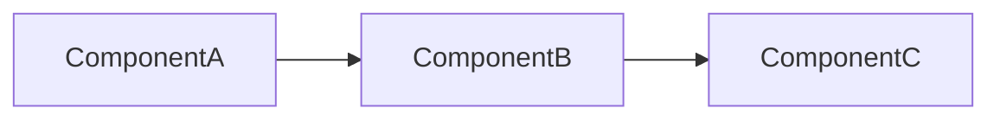
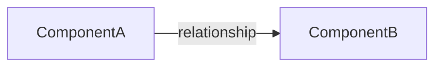

# Writing Training Doc

本技能協助為任何技術工具或框架產出實作型課程文件，風格依循「做中學」原則：先讓學員完成一個可執行、可觀察的小流程，再用流程反推概念。

---

## 文件類型選擇決策

> **所有文件類型統一輸出為 Markdown（`.md`）格式。**

當使用者請求模糊（如「幫我做教材」）時，按以下順序判斷：

1. **使用者有提到具體工具 + 特定功能** → 優先產出「實作 Lab」
2. **使用者提到需要解釋名詞或概念** → 先產出「名詞導讀」，再接 Lab
3. **使用者要整套課程或課程路線** → 先產出「README」，再列出建議的 Lab 清單
4. **使用者要一張快速查詢的參考表** → 產出「速查表」
5. **使用者提到某個 Lab 裡有複雜概念需要補充** → 產出「補充說明」

若仍無法判斷，主動問：
- 「這份文件是給已有操作基礎的人，還是完全的新手？」
- 「你希望產出單一 Lab，還是整套課程材料？」

---

## 課程文件類型

依需求選擇輸出文件類型：

| 文件類型 | 說明 | 命名慣例 |
| --- | --- | --- |
| README | 課程總覽、環境說明、課程路線 | `README.md` |
| 名詞導讀 | 術語介紹，附 UI 位置與使用原則 | `00-<topic>.md` |
| 實作 Lab | 手把手操作步驟，含練習題 | `01-<topic>.md`、`02-<topic>.md`… |
| 速查表 | 常用元件、指令、排錯索引 | `99-cheatsheet.md` |
| 補充說明 | 深度釐清特定觀念，被 Lab 引用 | `supplement-<topic>.md` |

---

## 課程目錄結構

原則：`docs/` 只放主要教學內容；可執行資產與環境設定放在 repo 根目錄或根目錄下的功能資料夾。

| 位置 | 放置內容 | 範例 |
| --- | --- | --- |
| repo 根目錄 | 環境入口與單檔設定 | `.env`、`docker-compose.yaml`、工具設定檔 |
| repo 根目錄功能資料夾 | 課程會用到的可執行資產 | `mock-api/`、`scripts/`、`sample-data/` |
| `docs/` | 主要教學內容文檔 | Lab、速查表、補充說明、課程 README |

### 教學內容（放 `docs/`）

判斷標準：
- 檔案主要用途是「教學說明」
- 學員主要用閱讀方式使用
- 即使不執行，也能作為課程內容被理解

適合放在 `docs/` 的檔案：`README.md`、`01-first-workflow.md`、`00-core-concepts.md`、`99-cheatsheet.md`、`supplement-*.md`、`environment-setup.md`

### 可執行資產與環境設定（放 repo 根目錄）

判斷標準：
- 檔案主要用途是「讓課程環境跑起來」
- 學員會透過指令、服務或程式執行它
- 屬於上課輔助教材，不是主要閱讀內容

- **根目錄單檔**：`.env`、`docker-compose.yaml`、單一工具設定檔
- **根目錄功能資料夾**：`mock-api/`、`scripts/`、`sample-data/`、`fixtures/`

### `.env` 規則

若 `.env` 只包含課程必要且非敏感的環境預設值，可以提交到 repo。

適合提交：Docker image 版本、課程固定 port、非敏感的 feature flag、課程用服務名稱

不應提交：密碼、token、個人本機路徑、私有服務連線字串

個人覆寫設定使用 `.env.local` 或 `.env.*.local`，並在 `.gitignore` 排除。

### 指令撰寫規則

課程中的環境指令預設從 repo 根目錄執行（包含 `docker-compose.yaml` 或主要環境入口檔的目錄）。

正確寫法：
```powershell
docker compose up -d
docker compose run --rm --no-deps <service-name> <check-command>
```

不建議寫法（`docs/` 不是環境啟動入口）：
```powershell
cd docs\<course-name>
docker compose up -d
```

---

## 課程檔名規則

- 一般主線 Lab 使用 `NN-topic.md`，例如 `01-first-flow.md`。
- 若某個 Lab 需要延伸成系列課程，改用 `NN-00-topic.md` 作為主課，後續用 `NN-01-topic.md`、`NN-02-topic.md` 擴充。
- 文件標題仍使用人類可讀的課程編號，例如 `# Lab 06：...`、`# Lab 06-1：...`、`# Lab 06-2：...`。
- 範例：
  - `06-00-database-integration.md` 對應 `Lab 06`
  - `06-01-database-read-copy.md` 對應 `Lab 06-1`
  - 未來可新增 `06-02-xxx.md` 對應 `Lab 06-2`

---

## 實作 Lab 文件結構

### 固定 Header

```markdown
# Lab NN：<主題>

目標：<一句話說明這個 Lab 要達成什麼>

預估時間：N 分鐘。
```

### 必要章節（照順序）

**1. 你會做出什麼**

用 mermaid flowchart LR 畫出完成後的資料流或操作流全貌。讓學員在動手前先有終點圖像。

```markdown
## 你會做出什麼



`ComponentA` 負責...，`ComponentB` 負責...
```

**2. Step 步驟群**

每個重大操作一個 Step，內部用有序列表。

```markdown
## Step N：<動詞 + 對象>

1. 打開 `<UI 位置或指令>`。
2. 設定 `<參數或選項>`：
   - `<key>`：`<value>`
3. 按 `Apply` 或執行 `<command>`。

說明：<解釋為什麼這樣設定，特別是業務邏輯或使用原則>
```

**Step 銜接性檢查**：每個 Step 都要用「新手是否能從上一個 Step 的狀態直接照做」來驗證；若前一步留下的設定會影響下一步，必須明確寫出要保留、修改或刪除哪些設定，不能假設學員自己判斷。

**3. 練習題**（可選，但建議加）

從「改一個參數觀察行為差異」出發，延伸核心觀念。

若練習題會沿用同一個元件，必須在題目開頭明確說明上一題留下的設定（例如：自訂屬性、連線關係、自動終止條件、排程設定）是否需要清除，不能讓學員自行推測。

```markdown
## 練習題

### 練習 N：<題目描述>

<情境說明>

確認方式：

1. <如何驗證這個練習是否成功>
```

**4. 完成檢查**

Checklist 列出學員完成後「應該理解的事」，不是操作步驟。

```markdown
## 完成檢查

- 你知道 <概念A> 的用途。
- 你能在 UI 或指令中找到 <功能B>。
- 你知道 <概念C> 與 <概念D> 的差異。
```

**5. 排錯提示**（可選）

列出可觀察狀態與處理方式，格式：`- <狀態或訊息特徵>：<判斷依據與處理方式>`。

**6. 本 Lab 的學習重點回顧**

這是最重要的結尾章節。用 mermaid 重畫整條 flow，再用文字說明每個節點在做什麼，最後點出這個 Lab 在實際專案的意義。

```markdown
## 本 Lab 的學習重點回顧

這個 Lab 建立的是 <flow 類型>：



整個流程的意思是：

1. `ComponentA` 負責...
2. 資料透過 `relationship` 進入...
3. `ComponentB` 負責...

做完後你要理解：

- <核心觀念一>
- <核心觀念二>
- <核心觀念三，對應實際專案的意義>
```

---

## 名詞導讀文件結構

```markdown
# Lab 00：<主題名稱>

目標：...

預估時間：N 分鐘。

<開頭說明：這份文件的閱讀方式>

## 一張圖先看整體


## <術語一>

<白話說明>

你在哪裡看到：

- <UI 位置或指令輸出>

使用原則：

- <規則、限制或判斷方式>

## <術語二>
...

## 一分鐘總結

<用 mermaid 或文字做最關鍵的精簡版整理>

## 本章學習重點回顧

<說明學完這章後，學員應能把名詞對應到實際操作流程>
```

---

## 速查表結構

```markdown
# <工具> 入門速查表

## 基本名詞速查

| 名詞 | 白話說明 | 常見位置 |
| --- | --- | --- |

## 常用元件 / 指令

| 類型 | 元件/指令 | 用途 |
| --- | --- | --- |

## 排錯提示

| 狀態或訊息特徵 | 判斷 | 處理 |
| --- | --- | --- |

## 排錯順序

1. <第一步>
2. <第二步>
```

---

## 補充說明文件結構

```markdown
# <概念名稱>：完整說明

<引言：說明這份補充文件的定位，通常是從 Lab 中引用過來的>

## 基本定義

## 常見判斷

| 情境 | 建議 |
| --- | --- |

## 與 Lab 的對照

<回應 Lab 中提到的具體情境，說明補充觀念>

## 延伸觀念（可選）
```

---

## README 結構

```markdown
# <課程名稱>

<課程目標一段話>

## 課程設計主旨

<說明教學方法論，例如「做中學」、「先實作再解釋」>

## 使用環境

<環境確認指令與連結>

## 課程路線

<有序列表，每行附相對路徑連結>

## 每個 Lab 的操作原則

<注意事項 bullet list>

## 完成課程後你應該能做到

<學習目標 bullet list>
```

---

## 寫作風格原則

**語言**：全部繁體中文。技術術語（元件名稱、參數名稱、UI 路徑、指令）保留原文並加反引號。

**語氣**：直接、精確、不繞彎。不堆大段理論，先讓學員動手，再解釋原因。

**語句風格**：優先使用正向、直接的敘述句建立穩定概念。課程文檔應直接說明規則、概念、操作條件與狀態判斷，避免先提出錯誤假設，再用回答或反駁的方式修正。

**章節標題**：排錯內容可以保留，但標題優先使用「排錯提示」、「狀態判斷」、「使用原則」。避免把「常見問題」、「常見錯誤」、「常見誤解」作為主要章節標題。

**排錯寫法**：保留必要錯誤碼、錯誤訊息與訊息特徵，但用「狀態、判斷、處理」描述。不要把排錯項目寫成「錯誤現象：原因」的反駁句，改成可觀察狀態與下一步處理。

```markdown
## 排錯提示

| 狀態或訊息特徵 | 判斷 | 處理 |
| --- | --- | --- |
| 畫面資料尚未顯示 | API 回應仍在等待或回傳空資料 | 檢查 Network 回應狀態與資料欄位 |
| 按鈕互動未觸發 | 事件綁定或目前狀態未符合觸發條件 | 檢查事件處理函式與 disabled 條件 |
```

**句型改寫**：把錯誤假設改成直接規則。

```markdown
避免：
- 以為每個情境都要新增一個模組：不一定。設定可以降低模組數量。
- 把快取層當純加速工具：不完整。它也會影響請求是否通過。
- 修改系統內建檔案：不要。升級時可能被覆蓋。

改成：
- 共用設定可以降低模組數量，不需要為每個情境都新增模組。
- 快取層同時負責加速與請求控管，會影響請求是否通過。
- 系統內建檔案應保持原樣，客製內容放在專案自己的路徑。
```

**尚未出現的內容**：遇到後續步驟才會建立的畫面、資料、檔案或設定，必須明確標示出現時機。

| 項目 | 出現時機 |
| --- | --- |
| 設定檔 | 完成初始化步驟後 |
| 資料表 | 執行 migration 後 |
| 管理頁面 | 啟用對應功能後 |

**反引號慣例**：
- UI 元件或功能名稱：`ComponentName`、`FeatureName`
- UI 操作路徑：`Settings` > `Advanced`
- 終端機指令：`docker compose up -d`
- 參數值：`true`、`60s`、`RFC 4180`
- 屬性 key/value：`timeout`、`retry-count`

**參數表格格式**：

| Parameter | Value |
| --- | --- |
| `<key>` | `<value>` |

**Mermaid 規則**：
- 方向統一用 `flowchart LR`（由左到右）或 `flowchart TD`（由上到下，適合多層判斷）
- 箭頭標籤用關係名稱：`-- success -->`、`-- failure -->`
- 虛線代表間接關係：`-. 使用 .->`
- mermaid 內不可用 `\n`，換行改用 `<br>`

**WHY 說明**：每個步驟後若有非顯而易見的原因，加一段 `說明：`。只在對學員有幫助時加，不加廢話。

**延伸閱讀**：補充文件用相對路徑引用：`延伸閱讀：[<標題>](supplement-<topic>.md)`

**Lab 編號**：`00` 起跳，主流 Lab 從 `01` 開始，速查表慣例用 `99`。系列課程用 `NN-00`、`NN-01`、`NN-02` 擴充，詳見「課程檔名規則」。

---

## 輸出前確認清單

- [ ] 文件開頭有 `目標：` 與 `預估時間：`
- [ ] 有 mermaid 流程圖（你會做出什麼 / 學習重點回顧）
- [ ] Step 內有參數表格（如適用）
- [ ] 關鍵步驟後有 `說明：` 解釋 WHY
- [ ] 結尾有「本 Lab 的學習重點回顧」，包含整條 flow 的意義說明
- [ ] 全文繁體中文，技術術語保留英文 + 反引號
- [ ] 沒有多餘的理論段落（只寫和當前 Lab 直接相關的內容）
- [ ] 每個 Step 已確認新手能從上一 Step 狀態直接銜接；有影響下一步的設定已明確標示保留／修改／刪除
- [ ] 沿用同一元件的練習題，已在題目開頭說明哪些上一題的設定（如自訂屬性、關聯關係、排程等）需要清除或保留
- [ ] 教學內容（Lab、README、速查表）放在 `docs/`，可執行資產（`.env`、`docker-compose.yaml`、`scripts/`）放在 repo 根目錄
- [ ] 課程環境指令從 repo 根目錄執行，未使用 `cd docs/...` 作為指令入口
- [ ] 已把主要章節中的「常見問題」、「常見錯誤」、「常見誤解」改成「排錯提示」、「狀態判斷」或「使用原則」
- [ ] 已掃描並改寫「以為...」、「把 X 當成 Y」、「X：錯」、「X：不一定」、「X：不完整」、「不要...」、「不是...而是...」等先提出錯誤假設再反駁的句型
- [ ] 排錯索引保留必要錯誤碼與訊息特徵，並使用「狀態、判斷、處理」格式
- [ ] 後續步驟才會出現的畫面、資料、檔案或設定，已明確標示出現時機
