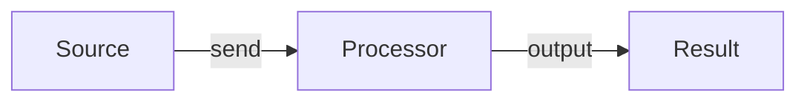

# Writing Training Doc

本技能用於產出實作型課程文件。寫作方式採「做中學」：先讓學員完成可執行、可觀察的小流程，再用流程反推概念。

## 文件類型選擇

所有文件統一輸出為 Markdown（`.md`）。

1. 有具體工具 + 特定功能：產出「實作 Lab」。
2. 需要解釋名詞或概念：先產出「名詞導讀」，再接 Lab。
3. 需要整套課程或路線：產出 `README.md`，再列建議 Lab 清單。
4. 需要快速查詢：產出 `99-cheatsheet.md`。
5. Lab 中有複雜概念要延伸：產出 `supplement-<topic>.md`。

若仍無法判斷，詢問學員程度與要產出單一 Lab 或整套材料。

| 類型 | 用途 | 命名 |
| --- | --- | --- |
| README | 課程總覽、環境、路線 | `README.md` |
| 名詞導讀 | 術語、UI 位置、使用原則 | `00-<topic>.md` |
| 實作 Lab | 手把手操作、練習、檢查 | `01-<topic>.md` |
| 速查表 | 指令、元件、排錯索引 | `99-cheatsheet.md` |
| 補充說明 | 深度概念補充 | `supplement-<topic>.md` |

## 目錄與檔名

- `docs/`：只放主要教學內容，如 `README.md`、Lab、速查表、補充說明、環境說明。
- repo 根目錄：放環境入口與單檔設定，如 `.env`、`docker-compose.yaml`。
- repo 根目錄功能資料夾：放可執行資產，如 `mock-api/`、`scripts/`、`sample-data/`、`fixtures/`。
- `.env` 只能提交課程必要且非敏感的預設值；密碼、token、個人路徑與私有連線字串改用 `.env.local` 並排除版控。
- 環境指令預設從 repo 根目錄執行，不把 `docs/` 當啟動入口。
- 主線 Lab 使用 `NN-topic.md`；系列課程使用 `NN-00-topic.md`、`NN-01-topic.md`。

環境指令範例：

```powershell
docker compose up -d
docker compose run --rm --no-deps <service-name> <check-command>
```

## 實作 Lab 結構

固定開頭：

```markdown
# Lab NN：<主題>

目標：<一句話說明這個 Lab 要達成什麼>

預估時間：N 分鐘。
```

必要章節順序：

1. `## 你會做出什麼`
   - 用 `flowchart LR` 畫完成後的資料流或操作流。
   - 圖後用短句說明每個節點責任。
2. `## Step N：<動詞 + 對象>`
   - 每個重大操作一個 Step，內部用有序列表。
   - 參數多於兩個時使用表格：`Parameter` / `Value`。
   - 非顯而易見的設定後加 `說明：` 解釋原因。
3. `## 練習題`
   - 從改一個參數觀察行為差異開始。
   - 若沿用同一元件，先說明上一題設定要保留、修改或清除。
4. `## 完成檢查`
   - 列學員應理解的概念，不列操作步驟。
5. `## 排錯提示`
   - 用「狀態或訊息特徵、判斷、處理」描述。
6. `## 本 Lab 的學習重點回顧`
   - 重畫整條 flow，說明每個節點與關係，最後點出實際專案意義。

Step 銜接性檢查：每個 Step 必須能從上一個 Step 的狀態直接照做；會影響下一步的設定要明確標示保留、修改或刪除。

Lab Mermaid 範例：



## 其他文件結構

### 名詞導讀

```markdown
# Lab 00：<主題名稱>

目標：...

預估時間：N 分鐘。

## 一張圖先看整體
## <術語一>
<白話說明>
你在哪裡看到：
- <UI 位置或指令輸出>
使用原則：
- <規則、限制或判斷方式>
## 一分鐘總結
## 本章學習重點回顧
```

### 速查表

```markdown
# <工具> 入門速查表

## 基本名詞速查
| 名詞 | 白話說明 | 常見位置 |
| --- | --- | --- |

## 常用元件 / 指令
| 類型 | 元件/指令 | 用途 |
| --- | --- | --- |

## 排錯提示
| 狀態或訊息特徵 | 判斷 | 處理 |
| --- | --- | --- |

## 排錯順序
```

### 補充說明

使用章節：`# <概念名稱>：完整說明`、`## 基本定義`、`## 常見判斷`、`## 與 Lab 的對照`、`## 延伸觀念（可選）`。

### README

使用章節：`# <課程名稱>`、`## 課程設計主旨`、`## 使用環境`、`## 課程路線`、`## 每個 Lab 的操作原則`、`## 完成課程後你應該能做到`。

## 寫作風格

- 全文使用繁體中文；技術術語、UI 名稱、參數、指令保留英文並加反引號。
- 語氣直接、精確，不堆理論；先操作，再解釋原因。
- 優先用正向、直接的敘述句建立概念，不用先提出錯誤假設再反駁的問答式語氣。
- 排錯內容可保留，但主要標題使用「排錯提示」、「狀態判斷」、「使用原則」。
- 保留必要錯誤碼與訊息特徵，排錯索引用「狀態或訊息特徵、判斷、處理」格式。
- 後續步驟才會建立的畫面、資料、檔案或設定，必須標示出現時機。
- UI 路徑寫成 `` `Settings` > `Advanced` ``；指令與參數值加反引號。
- 補充文件引用使用相對路徑：`延伸閱讀：[<標題>](supplement-<topic>.md)`。

句型改寫方向：

| 避免 | 改成 |
| --- | --- |
| `以為...` | 直接說明適用條件 |
| `把 X 當成 Y` | 直接說明 X 的完整責任 |
| `X：錯／不一定／不完整` | 改寫成正向規則 |
| `不要...` | 改寫成建議做法與原因 |
| `不是...而是...` | 改寫成單一肯定句 |

尚未出現的內容寫法：

| 項目 | 出現時機 |
| --- | --- |
| 設定檔 | 完成初始化步驟後 |
| 資料表 | 執行 migration 後 |
| 管理頁面 | 啟用對應功能後 |

## Mermaid 規則

- 使用 `flowchart LR` 或 `flowchart TD`。
- Node ID 只用英數與底線；Node label 必須加雙引號。
- Edge label 必須加雙引號；關係明顯時可省略。
- Mermaid 內不可用 `\n`，換行改用 `<br>`。
- 每行一個 Mermaid statement。

## 輸出前確認

- 文件開頭有 `目標：` 與 `預估時間：`。
- Lab 有 `你會做出什麼` 與 `本 Lab 的學習重點回顧` 的 Mermaid flow。
- Step 已檢查銜接狀態；會影響下一步的設定已標示保留、修改或刪除。
- 沿用同一元件的練習題已說明前題設定如何處理。
- 關鍵步驟有必要的 `說明：`。
- 主要章節已避免「常見問題」、「常見錯誤」、「常見誤解」。
- 已掃描並改寫反駁式句型：`以為...`、`把 X 當成 Y`、`X：錯`、`X：不一定`、`X：不完整`、`不要...`、`不是...而是...`。
- 排錯索引使用「狀態或訊息特徵、判斷、處理」。
- 後續才會出現的內容已標示出現時機。
- 教學內容放 `docs/`，可執行資產與環境入口放 repo 根目錄或根目錄功能資料夾。
